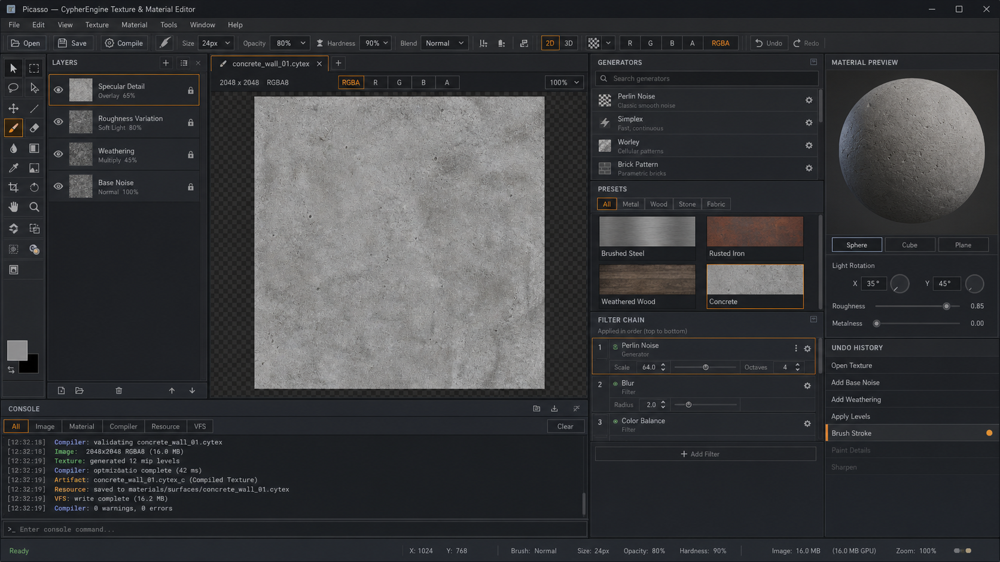

<!--
//////////////////////////////////////////////////////////////////////////
//
//  CypherEngine Source Code
//  Copyright (c) 2026 Karlo Siric. All rights reserved.
//
//  File: docs/PICASSO_V1.md
//  Purpose: Defines the product boundary and completion contract for Picasso 1.0.
//  Details: This document separates the required first release from later renderer,
//           collaboration, and general-purpose image-editing work. It is the checklist
//           used to decide whether a Picasso feature is implemented or still planned.
//
//  History:
//  - Created by Karlo Siric on 2026-08-18
//
//  This file is proprietary and confidential. See LICENSE for details.
//
//////////////////////////////////////////////////////////////////////////
-->

# Picasso 1.0

This image is the visual acceptance target for the primary texture workspace.
The implementation may adapt panel dimensions for smaller displays, but it must
preserve the same hierarchy, compact tool density, and dark industrial styling.

Picasso is CypherEngine's focused texture and material authoring application. It
is not intended to replace Photoshop, Krita, Blender, or Substance Designer.
Its job is to create, inspect, transform, assemble, validate, and cook the image
and material resources consumed by CypherEngine.

Picasso must run as a standalone Qt 6 application on Windows, Linux, and macOS.
The same non-Qt backend must remain usable by Mason, command-line tools, tests,
and future automated asset builds.

## Product Boundary

Picasso 1.0 is complete only when an artist can perform this workflow:

1. Open a Cypher project or create a standalone texture document.
2. Import supported source images through project/VFS paths.
3. Create or edit a texture using layers, masks, generators, filters, and channels.
4. Assemble a material from texture slots and material parameters.
5. Validate the authored `.cytex` and `.cymat` recipes.
6. Preview texture channels and the material result.
7. Invoke the existing texture/material compiler and inspect diagnostics.
8. Save authored recipes and export supported interchange images.
9. Reopen the project without losing document, layer, or material state.

The initial 3D material preview may use a deliberately limited preview renderer.
It must be replaced by the Cypher renderer once that renderer has a stable tool
embedding contract. Picasso must not implement a second production renderer.

## Required Architecture

| Boundary | Responsibility |
| --- | --- |
| `CypherImage` | Pixel formats, image views/surfaces, conversion, resize, mip and processing primitives |
| `CypherImageCodec` | PNG, JPEG, TGA and EXR interchange decoding; PNG export |
| `PicassoCore` | Documents, layers, masks, composition, tools, history and material state without Qt |
| `CypherTextureCompiler` | Validates `.cytex` and produces deterministic `.cytex_c` resources |
| `CypherMaterialCompiler` | Validates `.cymat` and produces deterministic `.cymat_c` resources |
| Picasso Qt frontend | Native windows, docks, dialogs, shortcuts, canvas presentation and interaction |
| Cypher command system | One command registry shared by menus, shortcuts, automation and the in-tool console |
| VFS/project integration | Resolves project content, dependencies, generated artifacts and read-only packages |

Widgets must never own the authoritative image or material data. UI actions send
commands to `PicassoCore`; the core mutates the document transactionally and the
frontend redraws from the resulting state.

## Texture Document

### Canvas and Channels

- Dimensions from 1x1 through 16384x16384, with tested presets through 4096x4096.
- RGBA channel inspection plus independent R, G, B and A views.
- sRGB and linear color-space metadata.
- Resize image, resize canvas, crop, rotate and flip.
- Correct alpha handling and transparent checkerboard presentation.
- Nearest, bilinear and high-quality downsample policies where appropriate.
- Mip-chain generation and inspection.

### Layers and Masks

- Ordered raster and procedural layers.
- Layer naming, visibility, opacity, locking, duplication and deletion.
- Layer groups and deterministic reordering.
- Per-layer masks with enable, invert, clear and apply operations.
- At minimum: normal, multiply, screen, overlay, add and subtract blend modes.
- Flatten selected, flatten group and flatten document operations.
- Selection state must remain separate from permanent pixels.

### Editing Tools

The left tool rail contains compact icon buttons for implemented tools only:

- Inspect/pixel sampler
- Pan and zoom
- Rectangular selection
- Crop
- Brush and eraser
- Fill and gradient
- Rectangle and ellipse primitives
- Move/transform selected layer
- Color picker

Every tool needs explicit cursor behavior, adjustable parameters, undo support,
and predictable cancellation. A visible button with no backend behavior is not
considered implementation.

### Generators and Filters

- Solid color and checkerboard.
- Gradient, value noise, Perlin/Simplex-style noise and cellular noise.
- Tile/brick/grid patterns suitable for graybox and retro environment textures.
- Blur, sharpen, invert, grayscale, threshold and posterize.
- Levels, brightness/contrast, gamma, hue/saturation and color balance.
- Height-to-normal conversion with strength and channel controls.
- Normal-map normalization and green-channel inversion.
- Roughness/metalness/AO channel packing.
- Edge padding/dilation for mip-safe authored content.

Expensive operations must support cancellation and execute outside the GUI event
loop. Preview may use reduced resolution; accepting the operation must process the
full-resolution document deterministically.

## Material Document

Picasso 1.0 supports the renderer-neutral material contract already represented
by `.cymat` and its schema:

- Base color, normal, roughness, metalness, ambient occlusion, emissive, height
  and opacity texture slots.
- Base-color tint, roughness, metalness, normal strength, emissive intensity and
  alpha cutoff scalar parameters.
- Opaque, masked and blended alpha modes.
- Two-sided and unlit flags where the selected shader contract permits them.
- Shader reference and validated parameter binding.
- Dependency diagnostics for missing or incompatible texture resources.
- 2D slot inspection and a sphere/cube/plane material preview.

The preview must expose lighting rotation and a neutral reference environment so
material response can be judged consistently.

## File And Project Workflow

### Import and Export

- Decode PNG, JPEG, TGA and EXR source images.
- Preserve source path, dimensions, color-space intent and alpha information.
- Export PNG in 1.0; additional interchange encoders are optional.
- glTF, GLB, FBX, USD and OBJ are model/scene formats and do not belong to the
  Picasso texture editor. Their material references may be inspected later through
  the model-import pipeline.

### Cypher Resources

- Author and reopen `.cytex` texture recipes.
- Author and reopen `.cymat` material recipes.
- Validate both recipes before publishing.
- Compile through the same compiler libraries used by `CypherResourceCompiler`.
- Show generated `.cytex_c` and `.cymat_c` artifacts without treating cooked files
  as editable source documents.

### VFS and Packages

- Open a project and mount its content roots through the Common VFS.
- Browse source and generated resources using normalized virtual paths.
- Treat package archives as read-only browse/import sources in 1.0.
- Never silently overwrite package contents or cooked output.
- Track dependencies so moved or missing resources produce actionable diagnostics.

## Console And Diagnostics

Picasso includes a Source-style console backed by the Common command system:

- Command history with Up/Down navigation.
- Tab completion from the live command registry.
- `help` and command-specific usage text.
- Colored command, info, warning and error records.
- Commands for document, image, layer, material, view, validation and compilation.
- A bounded output history and a clear command.
- Source locations and compiler diagnostic codes when available.

Menus, toolbar actions, shortcuts and console commands must call the same command
or document operation. The console is an automation and diagnostics surface, not
a parallel implementation of editor behavior.

## Workspace

- Central 2D texture canvas.
- Compact left tool rail.
- Layers and masks dock.
- Texture properties and channel controls.
- Generator/filter browser with searchable operations.
- Material slot and parameter inspector.
- Material preview dock.
- Asset browser backed by VFS.
- Console/diagnostics dock.
- Undo-history dock.
- Saveable and resettable Qt workspace layouts.

The interface uses a neutral dark palette so texture color remains trustworthy.
Cyan identifies active tools and selections; amber is reserved for warnings and
destructive or unsaved state.

## Platform And Delivery Contract

- Windows: native `.exe` plus Qt/runtime deployment produced by packaging scripts.
- Linux: native executable plus documented Qt/runtime package requirements.
- macOS: signed-ready `.app` bundle layout.
- CMake remains the source of truth for all three platforms.
- Platform packaging may differ, but document and compiler behavior must not.
- CI must build `PicassoCore` everywhere and build the Qt frontend on configured
  Qt runners before Picasso 1.0 is declared complete.

## Delivery Stages

1. **Editor shell:** shared codec, document core, canvas, commands, console and
   working tool rail.
2. **Composition:** real layers, masks, blending, selection and complete history.
3. **Texture authoring:** generators, filters, brush primitives and channel tools.
4. **Resource workflow:** `.cytex`, `.cymat`, VFS, validation and compiler bridge.
5. **Material workflow:** material state, slots, parameters and preview contract.
6. **Hardening:** large-image jobs, cancellation, recovery, platform packaging,
   accessibility, regression tests and performance budgets.

Picasso must not be labeled 1.0 until all six stages satisfy their tests and the
complete artist workflow at the top of this document succeeds on all supported
platforms.
