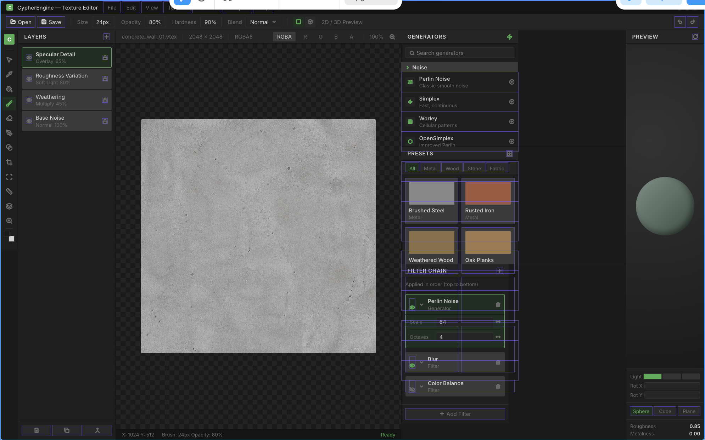

<!--
//////////////////////////////////////////////////////////////////////////
//
//  CypherEngine Source Code
//  Copyright (c) 2026 Karlo Siric. All rights reserved.
//
//  File: docs/picasso_v1_design.md
//  Purpose: Defines the approved first-version product and interface direction
//           for the Picasso texture and material authoring application.
//  Details: This document records workspace composition, visual language,
//           interaction rules, implementation boundaries, and the acceptance
//           gate for the future Qt 6 application. It is a design contract, not
//           permission to place asset semantics inside widgets.
//
//  History:
//  - Created by Karlo Siric on 2026-08-13
//
//  This file is proprietary and confidential. See LICENSE for details.
//
//////////////////////////////////////////////////////////////////////////
-->

# Picasso V1 Design

## Product Decision

Picasso is one focused Qt 6 desktop application for authoring Cypher textures
and materials. Version 1 contains two workspaces:

- **Texture** for source import, layers, procedural generators, filters, channel
  inspection, mip inspection, and `.cytex` compilation.
- **Material** for shader selection, typed texture bindings, numeric parameters,
  render-state controls, validation, preview geometry, and `.cymat` compilation.

The workspaces share application chrome, asset browsing, document management,
diagnostics, compilation, preview, undo/redo, and visual styling. Their document
models and editor commands remain separate so Mason can reuse each editor core
without embedding the Picasso window.

## Visual Direction

The approved direction is a dense, professional editor influenced by Valve's
Hammer tools. It is an operational authoring surface, not a marketing page and
not a collection of floating cards.



The image is a directional layout reference. Its visible layout guides, capture
chrome, placeholder content, and exact pixel colors are not implementation
requirements; the semantic rules and workspace contract in this document are
authoritative.

The palette has distinct semantic roles:

| Role | Direction | Use |
| --- | --- | --- |
| Window base | Near-black neutral graphite | Main frame and empty viewport regions |
| Raised surface | Dark neutral gray | Toolbars, dock panels, menus, inputs, and rows |
| Structural accent | Desaturated medium blue | Active workspace, keyboard focus, active tool, and dock focus |
| Selection accent | Warm amber/orange | Selected layers, selected resources, selected graph/property items, and viewport outlines |
| Success | Restrained green | Ready state, successful compilation, and valid live preview only |
| Warning/error | Amber-red and red | Diagnostics only; never ordinary decoration |
| Text | Cool off-white with muted gray secondary text | Labels, values, metadata, and disabled states |

Blue and orange must not compete on the same control. Blue answers "where is
focus or which mode is active?" Orange answers "which authored object is
selected?" Borders remain subtle except for keyboard focus, an active drop
target, or a selected viewport object.

## Application Frame

The default frame is composed from dockable Qt panels around one primary
workspace viewport:

```text
Menu bar
Workspace/document tabs
Context toolbar

Tool rail | Layers/Bindings | 2D canvas or material workspace | Authoring stack | Preview

Status bar / diagnostics summary
```

The layout must support saving and restoring named arrangements. Panels may be
resized, moved, tabbed, collapsed, and restored to the V1 default. The primary
canvas or material workspace always receives the largest share of available
space. Fixed-format controls use stable dimensions so state changes do not move
adjacent controls.

## Shared Chrome

Picasso V1 provides:

- File, Edit, View, Workspace, Build, and Help menus.
- New, Open, Save, Save As, Revert, undo, and redo commands.
- Texture and Material workspace switching through tabs or a compact segmented
  control rather than separate unrelated windows.
- Document tabs with modified, compiling, invalid, and read-only states.
- A contextual toolbar whose controls change with the active workspace/tool.
- A bottom status bar for cursor/UV position, zoom, active operation, compiler
  state, warning/error counts, and readiness.
- Dock visibility and layout-reset commands.
- Keyboard focus and shortcuts implemented through commands, never duplicated
  directly across widgets.

Icon-only buttons use the Qt-compatible project icon set and tooltips. Text is
kept for commands whose meaning is not represented reliably by a familiar icon.

## Texture Workspace

The default Texture layout follows the approved reference:

### Left Tool Rail

A narrow vertical rail selects tools such as selection, sample/eyedropper,
paint, fill, eraser, transform, crop, region selection, measurement, and zoom.
Only tools implemented by the document core appear enabled.

### Layers Panel

The Layers panel shows a stable ordered stack with:

- visibility and lock state
- layer name and type
- blend mode and opacity summary
- active-layer selection
- reorder, duplicate, merge, group, and delete commands where supported

Selection uses the warm accent. Visibility, lock, and error states remain
separate icon states and are never encoded by selection color alone.

### 2D Canvas

The central canvas provides checkerboard transparency, pan, zoom, channel
inspection, mip selection, pixel/UV readout, and fit/actual-size commands. Its
header shows the resource path, dimensions, pixel format, active channels, and
zoom. The canvas must remain usable when the 3D preview is hidden.

### Authoring Panel

The right authoring stack contains searchable sections:

- Generators
- Presets
- Filter chain
- Parameters for the selected generator/filter

Generators and filters are non-destructive document operations in V1. Each
operation exposes enabled state, reorder, duplicate, remove, reset, and typed
parameters. Long operations report progress and support cancellation through
the shared tool contracts.

### Texture Preview

The preview panel can display the selected texture with RGBA, RGB, individual
channel, luminance, normal-map, mip, exposure, checkerboard, and grid options.
It consumes `Cypher::RenderPreview`; it does not create backend objects in Qt.

## Material Workspace

Material mode reuses the application frame but replaces texture-specific panels:

- The left panel contains material sections and inherited/overridden values.
- The central area presents typed shader, texture-slot, scalar/vector, and
  render-state properties.
- The authoring panel provides resource search, compatible texture assignment,
  validation, defaults, and dependency information.
- The preview panel renders plane, cube, or sphere geometry with orbit, lighting,
  environment, exposure, roughness, and metalness inspection controls.

Version 1 is property-based. A material node graph is deferred until shader
reflection, permutation policy, and a runtime graph consumer justify it.

## Preview Rules

Picasso previews either:

1. a retained cooked runtime resource handle, or
2. an in-memory cooked result produced from the current unsaved document.

The second path enables edit, compile, and preview without writing temporary
resources into the project. Preview requests carry document revision and request
IDs so stale work cannot replace a newer frame. The first implementation remains
synchronous at the Common contract; Picasso may schedule it away from the UI
thread through an editor-owned job once the renderer provider exists.

## Architecture Boundary

```text
Picasso Qt shell
    -> TextureEditorCore / MaterialEditorCore
        -> undoable document commands
        -> schema and semantic validation
        -> CypherTextureCompiler / CypherMaterialCompiler
        -> VFS and resource references
        -> Cypher::RenderPreview

Renderer preview provider
    -> cooked resource readers
    -> renderer-owned backend objects
    -> caller-owned RGBA8 preview output
```

Qt owns windows, docking, models/views, actions, menus, input dispatch, and
native desktop integration. Editor cores own documents, commands, selection,
validation, dirty state, compilation requests, and workspace semantics. Common,
formats, compilers, and runtime resource loaders must not include Qt headers.

## V1 Non-Goals

The first version does not require:

- a Vulkan renderer
- a node-based material graph
- full Photoshop-class raster painting
- GPU-native handles exposed to Qt
- a second copy of Texture or Material logic inside Mason
- collaborative editing, source-control ownership, or distributed cooking
- every generator or filter planned for the final product

These omissions keep V1 usable and technically coherent while preserving room
for later growth.

## Implementation Gate

Qt implementation starts only after:

1. texture and material source/cooked contracts remain green in CI
2. compiler libraries can compile in-memory documents and return structured
   diagnostics without invoking the CLI process
3. runtime loaders own and validate cooked shader, texture, and material data
4. a real renderer implements the preview service for texture and material
5. editor-core document ownership, commands, dirty-state, and cancellation
   policies are reviewed together

The first Qt milestone is a shell with dock persistence and mock document models.
It must not silently grow asset semantics inside widget callbacks.

## V1 Acceptance Criteria

Picasso V1 is complete when a user can:

1. create or open `.cytex` and `.cymat` documents
2. edit supported values with undo/redo and correct dirty-state handling
3. receive source-located validation diagnostics
4. compile through the same libraries used by `CypherResourceCompiler`
5. preview saved and unsaved cooked results through the real renderer path
6. inspect texture channels/mips and material preview geometry
7. save and restore a practical dock layout
8. close, revert, or recover modified documents without data loss
9. run the same workflows on Windows, Linux, and macOS
