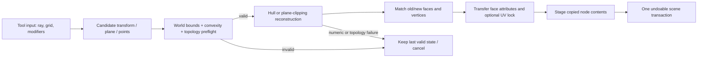

<!--
CypherEngine Research Note
File: docs/trenchbroom_geometry_algorithms.md
Purpose: Source-level geometry and map-editing algorithm audit used to design
         original Cypher implementations.
Provenance: Produced by studying TrenchBroom at the pinned revision below.
TrenchBroom is GPL-3.0-or-later. This is not a clean-room specification.
Original analysis © 2026 Karlo Siric; upstream rights remain with their owners.
Do not mechanically translate source-derived material into Cypher.
-->

# TrenchBroom Geometry and Map-Editing Algorithm Audit

**Audited repository:** `TrenchBroom/TrenchBroom`
**Audited revision:** `e53a0ef172e10e62ff24b86b70ca3b6ea865cac4`
**Audit date:** 2026-09-17
**Purpose:** an implementation-oriented description of TrenchBroom's geometry behavior for designing an original Cypher/TileEditor/Mason implementation.

All source and test links below are immutable links to the audited revision. TrenchBroom is `GPL-3.0-or-later`. This report describes algorithms, data flow, invariants, failure behavior, and tests; it deliberately does not reproduce implementation code. It is not a clean-room specification because it was produced by reading the GPL source. Any Cypher implementation should be newly written from the concepts, use its own types and APIs, preserve provenance in engineering notes, and receive a licensing review before code derived from TrenchBroom is shipped.

## Table of contents

- [1. Scope and audit method](#1-scope-and-audit-method)
- [2. Architectural result](#2-architectural-result)
- [3. Convex brush representation and invariants](#3-convex-brush-representation-and-invariants)
- [4. Construction from planes and points](#4-construction-from-planes-and-points)
- [5. Clipping, healing, and numerical policy](#5-clipping-healing-and-numerical-policy)
- [6. Containment, intersection, bounds, and picking](#6-containment-intersection-bounds-and-picking)
- [7. Grid behavior and coordinate conversion](#7-grid-behavior-and-coordinate-conversion)
- [8. Object-level move, rotate, scale, shear, and flip](#8-object-level-move-rotate-scale-shear-and-flip)
- [9. Vertex, edge, face, split, and snap editing](#9-vertex-edge-face-split-and-snap-editing)
- [10. Clipping, dragging, and extrusion tools](#10-clipping-dragging-and-extrusion-tools)
- [11. CSG subtract, intersect, convex merge, and hollow](#11-csg-subtract-intersect-convex-merge-and-hollow)
- [12. Shape generation, assemble-brush, sweep, and patches](#12-shape-generation-assemble-brush-sweep-and-patches)
- [13. Texture projection, transforms, alignment, and UV locking](#13-texture-projection-transforms-alignment-and-uv-locking)
- [14. Duplication, parenting, and linked geometry](#14-duplication-parenting-and-linked-geometry)
- [15. Transactions, rollback, and failure semantics](#15-transactions-rollback-and-failure-semantics)
- [16. Complexity and performance clues](#16-complexity-and-performance-clues)
- [17. Recommended original Cypher design](#17-recommended-original-cypher-design)
- [18. Required Cypher test matrix](#18-required-cypher-test-matrix)
- [19. Limits and design decisions exposed by the audit](#19-limits-and-design-decisions-exposed-by-the-audit)
- [20. Coverage conclusion](#20-coverage-conclusion)
- [Appendix A: file inventory and coverage](#appendix-a-file-inventory-and-coverage)
- [Appendix B: compact algorithm checklist](#appendix-b-compact-algorithm-checklist)

## 1. Scope and audit method

This audit follows geometry from low-level topology through editor commands:

1. the generic convex polyhedron and brush face/plane model;
2. brush construction, convex hull construction, clipping, validity, intersection, and CSG;
3. grid snapping, coordinate conversions, numeric tolerances, and healing;
4. scene picking, spatial indexing, bounds, and selection geometry;
5. object, vertex, edge, face, clip, extrude, rotate, scale, shear, flip, split, duplicate, and reparent operations;
6. primitive, arch, stair, assemble-brush, sweep, and patch generation;
7. texture projection, UV editing, UV locking, and topology-to-attribute matching;
8. transactions, rollback, partial-success policy, performance characteristics, and regression coverage.

The audit is source-level rather than UI-manual-level: every material statement points to the implementation or a test. I read the complete relevant functions in the files listed in [Appendix A](#appendix-a-file-inventory-and-coverage), then cross-checked the important contracts against focused tests. Renderer-only code, file parsers, and unrelated application UI were excluded.

## 2. Architectural result

TrenchBroom's central choice is **convex constructive geometry**. A brush stores authored planes/faces and a derived, closed, convex half-edge polyhedron. Most edits do not attempt to preserve every topology object in place. They produce a candidate point set or plane set, reconstruct a convex polyhedron, match new faces to old faces for material metadata, validate it, and only then replace the model. The brush alias and face/vertex payloads make that relationship explicit ([`BrushGeometry.h`, lines 28-45](https://github.com/TrenchBroom/TrenchBroom/blob/e53a0ef172e10e62ff24b86b70ca3b6ea865cac4/lib/TbMdlLib/include/mdl/BrushGeometry.h#L28-L45), [`Polyhedron_BrushGeometryPayload.h`, lines 32-42](https://github.com/TrenchBroom/TrenchBroom/blob/e53a0ef172e10e62ff24b86b70ca3b6ea865cac4/lib/TbMdlLib/include/mdl/Polyhedron_BrushGeometryPayload.h#L32-L42)).



The practical lessons for Cypher are:

- Treat brush geometry as a validated value, not as an arbitrary mesh. A committed brush is convex, closed, bounded, and internally consistent.
- Separate geometry identity from face attributes. Topology is rebuilt frequently, so material/UV metadata needs an explicit matching policy.
- Put validity checks before model mutation and stage edits on copies. Low-level geometry routines may fail after doing intermediate work; the map layer supplies atomicity.
- Define tolerance roles centrally. TrenchBroom has separate thresholds for plane classification, point correction, collinearity, topology proximity, and minimum edge length.
- Distinguish commands that must be all-or-nothing from operations whose product definition permits skipping individual brushes.

## 3. Convex brush representation and invariants

### 3.1 Half-edge topology

The generic `Polyhedron<T, FacePayload, VertexPayload>` owns vertices, undirected edges, directed half-edges, and faces in stable pools, with intrusive circular lists for collection traversal. A vertex stores its position and one leaving half-edge; an edge owns two opposite half-edges; a half-edge stores origin, edge, face, and next/previous boundary links; and a face stores a circular half-edge boundary, plane, and payload ([`Polyhedron.h`, lines 87-215](https://github.com/TrenchBroom/TrenchBroom/blob/e53a0ef172e10e62ff24b86b70ca3b6ea865cac4/lib/TbMdlLib/include/mdl/Polyhedron.h#L87-L215), [lines 237-478](https://github.com/TrenchBroom/TrenchBroom/blob/e53a0ef172e10e62ff24b86b70ca3b6ea865cac4/lib/TbMdlLib/include/mdl/Polyhedron.h#L237-L478), [lines 500-704](https://github.com/TrenchBroom/TrenchBroom/blob/e53a0ef172e10e62ff24b86b70ca3b6ea865cac4/lib/TbMdlLib/include/mdl/Polyhedron.h#L500-L704), [lines 1104-1202](https://github.com/TrenchBroom/TrenchBroom/blob/e53a0ef172e10e62ff24b86b70ca3b6ea865cac4/lib/TbMdlLib/include/mdl/Polyhedron.h#L1104-L1202)). Stable pools are sized from empirical brush topology: pages hold 16 vertices, 32 edges, 64 half-edges, and 16 faces, with a comment that roughly 99% of a sampled 150,000-brush corpus fits one page ([`Polyhedron.h`, lines 55-70](https://github.com/TrenchBroom/TrenchBroom/blob/e53a0ef172e10e62ff24b86b70ca3b6ea865cac4/lib/TbMdlLib/include/mdl/Polyhedron.h#L55-L70)).

A polyhedron may temporarily represent five dimensional states: empty, point, edge, polygon, or volume. `closed()` uses the Euler relation `V + F = E + 2` for a volume, rather than treating every intermediate object as a valid brush ([`Polyhedron.h`, lines 1434-1487](https://github.com/TrenchBroom/TrenchBroom/blob/e53a0ef172e10e62ff24b86b70ca3b6ea865cac4/lib/TbMdlLib/include/mdl/Polyhedron.h#L1434-L1487)). This dimensional state machine is fundamental to hull construction and component editing.

`Brush` stores the authored `BrushFace` array and an owned `BrushGeometry`. A face payload optionally records the corresponding authored face index; a vertex payload is an application value initialized to its maximum value. A brush's topology proximity threshold is `0.01`, and the generic polyhedron's minimum legal edge length is also `0.01` ([`Brush.h`, lines 46-80](https://github.com/TrenchBroom/TrenchBroom/blob/e53a0ef172e10e62ff24b86b70ca3b6ea865cac4/lib/TbMdlLib/include/mdl/Brush.h#L46-L80), [`Polyhedron.h`, line 1112](https://github.com/TrenchBroom/TrenchBroom/blob/e53a0ef172e10e62ff24b86b70ca3b6ea865cac4/lib/TbMdlLib/include/mdl/Polyhedron.h#L1112)).

### 3.2 Face planes and winding

A brush face is defined by three points. Their order determines the plane normal and therefore which half-space is inside. The header documents the required winding for front/right/top views; creation rejects points that cannot form a plane and chooses a paraxial or parallel UV coordinate system according to map format ([`BrushFace.h`, lines 62-78](https://github.com/TrenchBroom/TrenchBroom/blob/e53a0ef172e10e62ff24b86b70ca3b6ea865cac4/lib/TbMdlLib/include/mdl/BrushFace.h#L62-L78), [`BrushFace.cpp`, lines 176-246](https://github.com/TrenchBroom/TrenchBroom/blob/e53a0ef172e10e62ff24b86b70ca3b6ea865cac4/lib/TbMdlLib/src/BrushFace.cpp#L176-L246)). Faces are sorted deterministically by normal components and then plane distance before reconstruction, making results less sensitive to input order ([`BrushFace.cpp`, lines 249-270](https://github.com/TrenchBroom/TrenchBroom/blob/e53a0ef172e10e62ff24b86b70ca3b6ea865cac4/lib/TbMdlLib/src/BrushFace.cpp#L249-L270)). Updating a face's three points first corrects their coordinates and then recreates the plane, rejecting a collinear result ([`BrushFace.cpp`, lines 869-890](https://github.com/TrenchBroom/TrenchBroom/blob/e53a0ef172e10e62ff24b86b70ca3b6ea865cac4/lib/TbMdlLib/src/BrushFace.cpp#L869-L890)).

### 3.3 Structural checks

The check suite validates legal counts for each dimensional state, Euler consistency, minimum incident degree for volume vertices, at most two shared vertices between a pair of faces, face-boundary ownership, twin and face references, fully specified volume edges, faces with at least three edges, correct vertex leaving-edge rings, edge-to-face consistency, minimum edge length, and uniqueness around a vertex ring ([`Polyhedron_Checks.h`, lines 83-237](https://github.com/TrenchBroom/TrenchBroom/blob/e53a0ef172e10e62ff24b86b70ca3b6ea865cac4/lib/TbMdlLib/include/mdl/Polyhedron_Checks.h#L83-L237), [lines 264-468](https://github.com/TrenchBroom/TrenchBroom/blob/e53a0ef172e10e62ff24b86b70ca3b6ea865cac4/lib/TbMdlLib/include/mdl/Polyhedron_Checks.h#L264-L468)). Standalone checks also verify convexity by requiring no vertex above any face and reject adjacent coplanar faces, but those two expensive/noisy checks are deliberately excluded from the aggregate checker ([`Polyhedron_Checks.h`, lines 27-80](https://github.com/TrenchBroom/TrenchBroom/blob/e53a0ef172e10e62ff24b86b70ca3b6ea865cac4/lib/TbMdlLib/include/mdl/Polyhedron_Checks.h#L27-L80), [lines 240-288](https://github.com/TrenchBroom/TrenchBroom/blob/e53a0ef172e10e62ff24b86b70ca3b6ea865cac4/lib/TbMdlLib/include/mdl/Polyhedron_Checks.h#L240-L288)).

The regression suite exercises empty/point/edge/polygon/volume transitions, tetrahedra, cubes, redundant and interior points, duplicate points, and historical degenerate configurations ([`tst_Polyhedron.cpp`, lines 101-910](https://github.com/TrenchBroom/TrenchBroom/blob/e53a0ef172e10e62ff24b86b70ca3b6ea865cac4/lib/TbMdlLib/test/src/tst_Polyhedron.cpp#L101-L910)).

## 4. Construction from planes and points

### 4.1 Brush reconstruction from face planes

Brush creation is a bounded half-space intersection:

1. sort the authored faces deterministically;
2. initialize geometry as the world-bounds cuboid;
3. clip that cuboid against every face plane, keeping the inside half-space;
4. attach the authored face index to each newly created cap;
5. correct coordinates and heal edges below the minimum length;
6. remove authored faces that never contributed a boundary;
7. fail if a resulting geometry face has no source payload or the result is empty;
8. commit the new face list and geometry only after the candidate is complete.

That complete flow is in [`Brush.cpp`, lines 176-237](https://github.com/TrenchBroom/TrenchBroom/blob/e53a0ef172e10e62ff24b86b70ca3b6ea865cac4/lib/TbMdlLib/src/Brush.cpp#L176-L237). Moving a face boundary transforms the selected plane and rebuilds; expansion offsets every face along its normal and rebuilds, so both operations inherit the same validation and redundancy handling ([`Brush.cpp`, lines 403-433](https://github.com/TrenchBroom/TrenchBroom/blob/e53a0ef172e10e62ff24b86b70ca3b6ea865cac4/lib/TbMdlLib/src/Brush.cpp#L403-L433)). Brush construction and clipping behavior are exercised in [`tst_Brush.cpp`, lines 369-524](https://github.com/TrenchBroom/TrenchBroom/blob/e53a0ef172e10e62ff24b86b70ca3b6ea865cac4/lib/TbMdlLib/test/src/tst_Brush.cpp#L369-L524).

Attribute transfer is geometric rather than index-based. The brush first seeks an exact coplanar source; otherwise it chooses the largest coplanar or closest center-to-plane relation, and it can inspect inverted source planes for a newly exposed CSG cut ([`Brush.cpp`, lines 331-400](https://github.com/TrenchBroom/TrenchBroom/blob/e53a0ef172e10e62ff24b86b70ca3b6ea865cac4/lib/TbMdlLib/src/Brush.cpp#L331-L400)).

### 4.2 Incremental convex hull

The point-based constructor sorts and deduplicates input, computes a scale-aware point-classification epsilon, and feeds points to an incremental hull. The exact formula is `max(point_status_epsilon, (max_extent / 10) * point_status_epsilon)`; for the audited `double` constants, the scale-dependent term is effectively `max_extent * 1e-5`, rather than one tenth of the extent ([`Polyhedron_ConvexHull.h`, lines 43-70](https://github.com/TrenchBroom/TrenchBroom/blob/e53a0ef172e10e62ff24b86b70ca3b6ea865cac4/lib/TbMdlLib/include/mdl/Polyhedron_ConvexHull.h#L43-L70)). A new point closer than the minimum legal edge length to an existing vertex is ignored ([`Polyhedron_ConvexHull.h`, lines 74-113](https://github.com/TrenchBroom/TrenchBroom/blob/e53a0ef172e10e62ff24b86b70ca3b6ea865cac4/lib/TbMdlLib/include/mdl/Polyhedron_ConvexHull.h#L74-L113)).

The state machine is:

- empty plus one point becomes a point;
- a distinct second point becomes an edge;
- a collinear third point either lies inside the edge and is ignored or extends an endpoint;
- a non-collinear third point becomes a polygon;
- a coplanar point grows the polygon by replacing the visible boundary chain with two new edges;
- a non-coplanar point turns a polygon into a closed volume;
- a point outside a volume removes the connected visible face cap and cones the horizon to the new vertex.

The lower-dimensional transitions are implemented at [`Polyhedron_ConvexHull.h`, lines 115-265](https://github.com/TrenchBroom/TrenchBroom/blob/e53a0ef172e10e62ff24b86b70ca3b6ea865cac4/lib/TbMdlLib/include/mdl/Polyhedron_ConvexHull.h#L115-L265); coplanar polygon growth is at [lines 268-355](https://github.com/TrenchBroom/TrenchBroom/blob/e53a0ef172e10e62ff24b86b70ca3b6ea865cac4/lib/TbMdlLib/include/mdl/Polyhedron_ConvexHull.h#L268-L355); and volume growth, visible-cap discovery, seam opening, coning, and coplanar-face merging are at [lines 357-427](https://github.com/TrenchBroom/TrenchBroom/blob/e53a0ef172e10e62ff24b86b70ca3b6ea865cac4/lib/TbMdlLib/include/mdl/Polyhedron_ConvexHull.h#L357-L427), [lines 635-746](https://github.com/TrenchBroom/TrenchBroom/blob/e53a0ef172e10e62ff24b86b70ca3b6ea865cac4/lib/TbMdlLib/include/mdl/Polyhedron_ConvexHull.h#L635-L746), and [lines 840-981](https://github.com/TrenchBroom/TrenchBroom/blob/e53a0ef172e10e62ff24b86b70ca3b6ea865cac4/lib/TbMdlLib/include/mdl/Polyhedron_ConvexHull.h#L840-L981).

Before altering a volume, the algorithm verifies that the horizon is one usable loop. Multiple loops, a bad seam, or a numerically ambiguous point cause that point to be skipped rather than corrupting the existing hull. Coplanar faces around the new cap are merged afterward. Tests cover dimensional transitions, redundant/interior points, duplicate input, cube and tetrahedral hulls, and regression data ([`tst_Polyhedron.cpp`, lines 101-910](https://github.com/TrenchBroom/TrenchBroom/blob/e53a0ef172e10e62ff24b86b70ca3b6ea865cac4/lib/TbMdlLib/test/src/tst_Polyhedron.cpp#L101-L910)).

For Cypher, keep the two constructors distinct: plane intersection preserves authored plane intent, while a point hull intentionally discards concavity and interior points.

## 5. Clipping, healing, and numerical policy

### 5.1 Polyhedron clipping

The clip primitive classifies all vertices against a plane with an epsilon. If nothing is strictly above, it returns unchanged; if nothing is strictly below, the kept half is empty. Otherwise it discovers an intersection seam by walking face-plane intersections, opens the seam, deletes the rejected component, caps the hole, removes redundant seam vertices, and recomputes the bounding box ([`Polyhedron_Clip.h`, lines 74-180](https://github.com/TrenchBroom/TrenchBroom/blob/e53a0ef172e10e62ff24b86b70ca3b6ea865cac4/lib/TbMdlLib/include/mdl/Polyhedron_Clip.h#L74-L180), [lines 203-275](https://github.com/TrenchBroom/TrenchBroom/blob/e53a0ef172e10e62ff24b86b70ca3b6ea865cac4/lib/TbMdlLib/include/mdl/Polyhedron_Clip.h#L203-L275)).

A face-plane intersection has several cases: a strict crossing inserts a vertex on an edge; touching an existing vertex need not split; two on-plane adjacent vertices already define a seam edge; two separated on-plane points split a face by a diagonal. The implementation and its face-split mechanics are in [`Polyhedron_Clip.h`, lines 343-475](https://github.com/TrenchBroom/TrenchBroom/blob/e53a0ef172e10e62ff24b86b70ca3b6ea865cac4/lib/TbMdlLib/include/mdl/Polyhedron_Clip.h#L343-L475). Incident traversal uses the half-edge ring around a vertex ([lines 482-513](https://github.com/TrenchBroom/TrenchBroom/blob/e53a0ef172e10e62ff24b86b70ca3b6ea865cac4/lib/TbMdlLib/include/mdl/Polyhedron_Clip.h#L482-L513)).

If floating-point classification predicts a split but a coherent seam cannot be found, the operation catches its internal `NoSeam` condition, rejoins any temporarily split faces, and returns the original polyhedron unchanged ([`Polyhedron_Clip.h`, lines 115-139](https://github.com/TrenchBroom/TrenchBroom/blob/e53a0ef172e10e62ff24b86b70ca3b6ea865cac4/lib/TbMdlLib/include/mdl/Polyhedron_Clip.h#L115-L139)). This is a valuable policy: ambiguity is a rejected edit, not permission to commit broken topology. Clip regressions are concentrated in [`tst_Polyhedron.cpp`, lines 911-1261](https://github.com/TrenchBroom/TrenchBroom/blob/e53a0ef172e10e62ff24b86b70ca3b6ea865cac4/lib/TbMdlLib/test/src/tst_Polyhedron.cpp#L911-L1261) and brush-level clipping in [`tst_Brush.cpp`, lines 369-403](https://github.com/TrenchBroom/TrenchBroom/blob/e53a0ef172e10e62ff24b86b70ca3b6ea865cac4/lib/TbMdlLib/test/src/tst_Brush.cpp#L369-L403).

### 5.2 Coordinate correction and edge healing

Coordinates close to simple decimal/integer values are corrected through a common scalar routine ([`scalar.h`, lines 686-714](https://github.com/TrenchBroom/TrenchBroom/blob/e53a0ef172e10e62ff24b86b70ca3b6ea865cac4/lib/VmLib/include/vm/scalar.h#L686-L714)). After reconstruction, healing repeatedly locates an edge shorter than the minimum threshold and removes it, repairing triangular adjacent faces and neighboring topology, until no illegal short edge remains or the object collapses ([`Polyhedron_Misc.h`, lines 891-1005](https://github.com/TrenchBroom/TrenchBroom/blob/e53a0ef172e10e62ff24b86b70ca3b6ea865cac4/lib/TbMdlLib/include/mdl/Polyhedron_Misc.h#L891-L1005)).

### 5.3 Tolerance roles

The vector-math library defines separate default values: roughly `1e-3` for almost-zero and coordinate correction, `1e-4` for plane point status, `1e-5` for collinearity, and `1e-8` for angle comparisons ([`constants.h`, lines 30-88](https://github.com/TrenchBroom/TrenchBroom/blob/e53a0ef172e10e62ff24b86b70ca3b6ea865cac4/lib/VmLib/include/vm/constants.h#L30-L88)). Topological proximity and minimum edge length use `0.01`, while hull classification can scale upward with world extent. Coplanar face matching is looser again: center-to-plane distance accepts ten times the almost-zero tolerance while normals must be collinear ([`BrushFace.cpp`, lines 417-433](https://github.com/TrenchBroom/TrenchBroom/blob/e53a0ef172e10e62ff24b86b70ca3b6ea865cac4/lib/TbMdlLib/src/BrushFace.cpp#L417-L433)).

Do not collapse these into a single `EPSILON` in Cypher. Define named policies such as `plane_classify_epsilon`, `coordinate_correction_epsilon`, `collinear_epsilon`, `topology_merge_distance`, `minimum_edge_length`, and a scale-aware hull epsilon. Test each policy at small and very large coordinates.

## 6. Containment, intersection, bounds, and picking

### 6.1 Geometric queries

Point containment first rejects against the cached axis-aligned bounding box, then requires the point to be on or below every outward face plane. Polyhedron containment similarly rejects by bounds and tests every vertex of the candidate ([`Polyhedron_Queries.h`, lines 38-82](https://github.com/TrenchBroom/TrenchBroom/blob/e53a0ef172e10e62ff24b86b70ca3b6ea865cac4/lib/TbMdlLib/include/mdl/Polyhedron_Queries.h#L38-L82)). General intersection dispatches by dimensional state rather than assuming two volumes ([`Polyhedron_Queries.h`, lines 85-188](https://github.com/TrenchBroom/TrenchBroom/blob/e53a0ef172e10e62ff24b86b70ca3b6ea865cac4/lib/TbMdlLib/include/mdl/Polyhedron_Queries.h#L85-L188)).

The specialized paths are worth preserving:

- edge/edge tests endpoints, collinear overlap, and closest segment distance within epsilon ([`Polyhedron_Queries.h`, lines 190-230](https://github.com/TrenchBroom/TrenchBroom/blob/e53a0ef172e10e62ff24b86b70ca3b6ea865cac4/lib/TbMdlLib/include/mdl/Polyhedron_Queries.h#L190-L230));
- segment/volume tests endpoint containment plus ray hits against faces, while edge/face handles parallel distance as a fallback ([lines 247-320](https://github.com/TrenchBroom/TrenchBroom/blob/e53a0ef172e10e62ff24b86b70ca3b6ea865cac4/lib/TbMdlLib/include/mdl/Polyhedron_Queries.h#L247-L320));
- polygon/polygon tests boundary intersections and containment ([lines 338-395](https://github.com/TrenchBroom/TrenchBroom/blob/e53a0ef172e10e62ff24b86b70ca3b6ea865cac4/lib/TbMdlLib/include/mdl/Polyhedron_Queries.h#L338-L395));
- volume/volume uses the separating-axis theorem with both objects' face normals and every cross product of an edge from one with an edge from the other ([lines 419-468](https://github.com/TrenchBroom/TrenchBroom/blob/e53a0ef172e10e62ff24b86b70ca3b6ea865cac4/lib/TbMdlLib/include/mdl/Polyhedron_Queries.h#L419-L468)).

The query tests cover every dimensional pairing and volume SAT regressions ([`tst_Polyhedron.cpp`, lines 1262-2087](https://github.com/TrenchBroom/TrenchBroom/blob/e53a0ef172e10e62ff24b86b70ca3b6ea865cac4/lib/TbMdlLib/test/src/tst_Polyhedron.cpp#L1262-L2087)); brush containment/intersection and historical cases are covered in [`tst_Brush.cpp`, lines 2307-2487](https://github.com/TrenchBroom/TrenchBroom/blob/e53a0ef172e10e62ff24b86b70ca3b6ea865cac4/lib/TbMdlLib/test/src/tst_Brush.cpp#L2307-L2487) and later regression sections beginning at [line 3429](https://github.com/TrenchBroom/TrenchBroom/blob/e53a0ef172e10e62ff24b86b70ca3b6ea865cac4/lib/TbMdlLib/test/src/tst_Brush.cpp#L3429).

Brush `contains(bounds)` checks all eight box corners after a bounding-box rejection; brush/brush containment and intersection delegate to the polyhedron; and bounds-only intersection is explicitly only an AABB test ([`Brush.cpp`, lines 1207-1238](https://github.com/TrenchBroom/TrenchBroom/blob/e53a0ef172e10e62ff24b86b70ca3b6ea865cac4/lib/TbMdlLib/src/Brush.cpp#L1207-L1238)). Cypher should keep names such as `intersects_bounds_approx` and `intersects_brush_exact` distinct to avoid accidental broad-phase answers being treated as exact.

### 6.2 Scene octree and narrow-phase picking

Scene nodes are indexed in an octree, not brush faces. A bounding box maps to the smallest dyadic cell that contains it; boxes crossing a root-plane boundary receive special root handling, and the address climbs until containment holds ([`Octree.h`, lines 93-195](https://github.com/TrenchBroom/TrenchBroom/blob/e53a0ef172e10e62ff24b86b70ca3b6ea865cac4/lib/TbMdlLib/include/mdl/Octree.h#L93-L195)). Insertion expands only the required path and stores an item once; removal collapses empty or single-child structure; a reverse data-to-address map makes lookup and updates direct ([`Octree.h`, lines 276-363](https://github.com/TrenchBroom/TrenchBroom/blob/e53a0ef172e10e62ff24b86b70ca3b6ea865cac4/lib/TbMdlLib/include/mdl/Octree.h#L276-L363), [lines 419-499](https://github.com/TrenchBroom/TrenchBroom/blob/e53a0ef172e10e62ff24b86b70ca3b6ea865cac4/lib/TbMdlLib/include/mdl/Octree.h#L419-L499)). Ray and bounds queries prune tree cells before returning candidates ([`Octree.h`, lines 518-595](https://github.com/TrenchBroom/TrenchBroom/blob/e53a0ef172e10e62ff24b86b70ca3b6ea865cac4/lib/TbMdlLib/include/mdl/Octree.h#L518-L595)); the model aliases this to `Octree<double, Node*>` ([`NodeTree.h`, lines 20-32](https://github.com/TrenchBroom/TrenchBroom/blob/e53a0ef172e10e62ff24b86b70ca3b6ea865cac4/lib/TbMdlLib/include/mdl/NodeTree.h#L20-L32)).

The world rebuilds that index from spatial nodes and uses candidate queries before exact node picking or containment ([`WorldNode.cpp`, lines 207-235](https://github.com/TrenchBroom/TrenchBroom/blob/e53a0ef172e10e62ff24b86b70ca3b6ea865cac4/lib/TbMdlLib/src/WorldNode.cpp#L207-L235), [lines 436-450](https://github.com/TrenchBroom/TrenchBroom/blob/e53a0ef172e10e62ff24b86b70ca3b6ea865cac4/lib/TbMdlLib/src/WorldNode.cpp#L436-L450)). A brush pick then applies visibility and AABB rejection and ray-tests its faces; a face rejects back-facing rays before ray/polygon intersection ([`BrushNode.cpp`, lines 345-383](https://github.com/TrenchBroom/TrenchBroom/blob/e53a0ef172e10e62ff24b86b70ca3b6ea865cac4/lib/TbMdlLib/src/BrushNode.cpp#L345-L383), [`BrushFace.cpp`, lines 855-866](https://github.com/TrenchBroom/TrenchBroom/blob/e53a0ef172e10e62ff24b86b70ca3b6ea865cac4/lib/TbMdlLib/src/BrushFace.cpp#L855-L866)). The map's public pick path is only a thin delegation ([`Map_Picking.cpp`, lines 28-38](https://github.com/TrenchBroom/TrenchBroom/blob/e53a0ef172e10e62ff24b86b70ca3b6ea865cac4/lib/TbMdlLib/src/Map_Picking.cpp#L28-L38)). Octree behavior is extensively tested in [`tst_Octree.cpp`, lines 29-727](https://github.com/TrenchBroom/TrenchBroom/blob/e53a0ef172e10e62ff24b86b70ca3b6ea865cac4/lib/TbMdlLib/test/src/tst_Octree.cpp#L29-L727), and scene picking in [`tst_Map_Picking.cpp`, lines 49-407](https://github.com/TrenchBroom/TrenchBroom/blob/e53a0ef172e10e62ff24b86b70ca3b6ea865cac4/lib/TbMdlLib/test/src/tst_Map_Picking.cpp#L49-L407).

### 6.3 Face connectivity and selection geometry

Connected coplanar-face selection is a flood fill. For each reached face, it queries the node octree by bounds, filters selectable coplanar faces, and requires the two polygons to share an overlapping collinear edge segment before adding a neighbor ([`ModelUtils.cpp`, lines 415-510](https://github.com/TrenchBroom/TrenchBroom/blob/e53a0ef172e10e62ff24b86b70ca3b6ea865cac4/lib/TbMdlLib/src/ModelUtils.cpp#L415-L510)). This is geometric adjacency across brush boundaries, not merely adjacency inside one brush.

Touching and inside selections traverse the visible/editable hierarchy and treat a closed group as one selectable unit. Brush-specific predicates decide containment or contact ([`ModelUtils.cpp`, lines 256-343](https://github.com/TrenchBroom/TrenchBroom/blob/e53a0ef172e10e62ff24b86b70ca3b6ea865cac4/lib/TbMdlLib/src/ModelUtils.cpp#L256-L343)). In a 2D view, “select touching” makes the selection effectively infinite along the camera axis by extending selected brush vertices to world bounds before containment tests ([`Map_Selection.cpp`, lines 92-193](https://github.com/TrenchBroom/TrenchBroom/blob/e53a0ef172e10e62ff24b86b70ca3b6ea865cac4/lib/TbMdlLib/src/Map_Selection.cpp#L92-L193)). Tests cover touching brushes, groups, nested groups, overlap stability, all three axial camera directions, and contained groups ([`tst_Map_Selection.cpp`, lines 238-426](https://github.com/TrenchBroom/TrenchBroom/blob/e53a0ef172e10e62ff24b86b70ca3b6ea865cac4/lib/TbMdlLib/test/src/tst_Map_Selection.cpp#L238-L426)).

Logical/physical node bounds are unions over descendants ([`ModelUtils.cpp`, lines 512-544](https://github.com/TrenchBroom/TrenchBroom/blob/e53a0ef172e10e62ff24b86b70ca3b6ea865cac4/lib/TbMdlLib/src/ModelUtils.cpp#L512-L544)). The map caches selected-node bounds; tools use the current selection, then the previous selection, then a default 16-unit cube as reference bounds ([`Map.cpp`, lines 981-1005](https://github.com/TrenchBroom/TrenchBroom/blob/e53a0ef172e10e62ff24b86b70ca3b6ea865cac4/lib/TbMdlLib/src/Map.cpp#L981-L1005), [`tst_Map_Selection.cpp`, lines 1228-1279](https://github.com/TrenchBroom/TrenchBroom/blob/e53a0ef172e10e62ff24b86b70ca3b6ea865cac4/lib/TbMdlLib/test/src/tst_Map_Selection.cpp#L1228-L1279)).

### 6.4 Vertex, edge, and face handles

The handle manager groups positions into spatial “clumps” within `0.01`. Adding a bridging position can merge clumps; removing one may dissolve and rebuild a clump; selection belongs to the clump so coincident geometry is edited together ([`NodeHandleManager.h`, lines 42-75](https://github.com/TrenchBroom/TrenchBroom/blob/e53a0ef172e10e62ff24b86b70ca3b6ea865cac4/lib/TbMdlLib/include/mdl/NodeHandleManager.h#L42-L75), [`tst_NodeHandleManager.cpp`, lines 411-734](https://github.com/TrenchBroom/TrenchBroom/blob/e53a0ef172e10e62ff24b86b70ca3b6ea865cac4/lib/TbMdlLib/test/src/tst_NodeHandleManager.cpp#L411-L734)). Handle picking itself is a linear scan over tracked handles ([`NodeHandleManager.h`, lines 93-235](https://github.com/TrenchBroom/TrenchBroom/blob/e53a0ef172e10e62ff24b86b70ca3b6ea865cac4/lib/TbMdlLib/include/mdl/NodeHandleManager.h#L93-L235), [`tst_NodeHandleManager.cpp`, lines 797-850](https://github.com/TrenchBroom/TrenchBroom/blob/e53a0ef172e10e62ff24b86b70ca3b6ea865cac4/lib/TbMdlLib/test/src/tst_NodeHandleManager.cpp#L797-L850)).

Vertex handles use point picking. Edge handles can pick the center or a grid-snapped point constrained to the segment. Face handles can pick the center or a grid-snapped point constrained to the polygon ([`NodeHandles.cpp`, lines 56-155](https://github.com/TrenchBroom/TrenchBroom/blob/e53a0ef172e10e62ff24b86b70ca3b6ea865cac4/lib/TbMdlLib/src/NodeHandles.cpp#L56-L155), [lines 158-235](https://github.com/TrenchBroom/TrenchBroom/blob/e53a0ef172e10e62ff24b86b70ca3b6ea865cac4/lib/TbMdlLib/src/NodeHandles.cpp#L158-L235)). A lasso lives in a plane orthogonal to the view; click selection chooses equivalent handles once per incident node and supports toggle modifiers; drag controllers can use absolute or relative snapping and can constrain movement to view-horizontal or view-vertical directions ([`NodeHandleToolControllerParts.h`, lines 48-100](https://github.com/TrenchBroom/TrenchBroom/blob/e53a0ef172e10e62ff24b86b70ca3b6ea865cac4/lib/TbAppLib/include/ui/NodeHandleToolControllerParts.h#L48-L100), [lines 102-375](https://github.com/TrenchBroom/TrenchBroom/blob/e53a0ef172e10e62ff24b86b70ca3b6ea865cac4/lib/TbAppLib/include/ui/NodeHandleToolControllerParts.h#L102-L375)).

## 7. Grid behavior and coordinate conversion

Grid size is an exponent from `-3` through `8`, yielding spacing `2^size`, or `0.125` through `256`. Disabling the grid makes the effective spacing one unit; angular snapping uses 15-degree increments ([`Grid.h`, lines 45-75](https://github.com/TrenchBroom/TrenchBroom/blob/e53a0ef172e10e62ff24b86b70ca3b6ea865cac4/lib/TbMdlLib/include/mdl/Grid.h#L45-L75), [`Grid.cpp`, lines 42-87](https://github.com/TrenchBroom/TrenchBroom/blob/e53a0ef172e10e62ff24b86b70ca3b6ea865cac4/lib/TbMdlLib/src/Grid.cpp#L42-L87)). Scalar snapping supports nearest, up, and down; nearest halves go away from zero. Vector and directional variants operate componentwise while respecting intended travel direction ([`Grid.h`, lines 83-240](https://github.com/TrenchBroom/TrenchBroom/blob/e53a0ef172e10e62ff24b86b70ca3b6ea865cac4/lib/TbMdlLib/include/mdl/Grid.h#L83-L240)).

Geometry-constrained snapping is more precise than simply rounding XYZ:

- plane snapping rounds the two coordinates other than the plane's dominant-normal axis, then solves the omitted coordinate from the plane equation ([`Grid.h`, lines 242-330](https://github.com/TrenchBroom/TrenchBroom/blob/e53a0ef172e10e62ff24b86b70ca3b6ea865cac4/lib/TbMdlLib/include/mdl/Grid.h#L242-L330));
- line snapping intersects the line with the next lower and upper grid planes for every nonzero direction component and chooses the closest parameter; segment snapping restricts that result to the segment, and polygon snapping also considers boundary edges ([lines 333-424](https://github.com/TrenchBroom/TrenchBroom/blob/e53a0ef172e10e62ff24b86b70ca3b6ea865cac4/lib/TbMdlLib/include/mdl/Grid.h#L333-L424));
- ray placement selects the nearest axial grid plane, and placement of a bounded object chooses a bounding-box corner according to hit-plane normal and ray direction ([`Grid.cpp`, lines 111-157](https://github.com/TrenchBroom/TrenchBroom/blob/e53a0ef172e10e62ff24b86b70ca3b6ea865cac4/lib/TbMdlLib/src/Grid.cpp#L111-L157), [lines 159-242](https://github.com/TrenchBroom/TrenchBroom/blob/e53a0ef172e10e62ff24b86b70ca3b6ea865cac4/lib/TbMdlLib/src/Grid.cpp#L159-L242));
- line-drag snapping evaluates drag against three planes through the nearest grid corner ([`Grid.cpp`, lines 244-267](https://github.com/TrenchBroom/TrenchBroom/blob/e53a0ef172e10e62ff24b86b70ca3b6ea865cac4/lib/TbMdlLib/src/Grid.cpp#L244-L267));
- face movement walks incident non-boundary edges, maps desired normal displacement to travel along each edge, snaps those candidates to grid planes, and selects the closest equivalent face displacement ([`Grid.cpp`, lines 269-309](https://github.com/TrenchBroom/TrenchBroom/blob/e53a0ef172e10e62ff24b86b70ca3b6ea865cac4/lib/TbMdlLib/src/Grid.cpp#L269-L309)).

Movement snapping also rejects a rounded component if rounding would reverse the user's requested direction ([`Grid.cpp`, lines 142-157](https://github.com/TrenchBroom/TrenchBroom/blob/e53a0ef172e10e62ff24b86b70ca3b6ea865cac4/lib/TbMdlLib/src/Grid.cpp#L142-L157)). The grid test file covers scalar, vector, plane, line, segment, polygon, ray, movement, and face snapping ([`tst_Grid.cpp`, lines 54-575](https://github.com/TrenchBroom/TrenchBroom/blob/e53a0ef172e10e62ff24b86b70ca3b6ea865cac4/lib/TbMdlLib/test/src/tst_Grid.cpp#L54-L575)).

For 2D-to-3D conversion, tools generally intersect or lift through an explicit construction plane. Assemble-brush creation swizzles coordinates so the plane's dominant axis becomes the solved coordinate, snaps 2D rectangle bounds down/up, and evaluates the plane equation to lift four corners into world space ([`AssembleBrushToolController3D.cpp`, lines 72-143](https://github.com/TrenchBroom/TrenchBroom/blob/e53a0ef172e10e62ff24b86b70ca3b6ea865cac4/lib/TbAppLib/src/AssembleBrushToolController3D.cpp#L72-L143)). UV tools have separate world/face/UV matrices; those are described in section 13.

## 8. Object-level move, rotate, scale, shear, and flip

### 8.1 Common map transformation path

Selection transformation is hierarchy-aware. It traverses selected groups and descendants, transforms point-entity origins, transforms brush-entity properties only when all children are selected and the entity is not worldspawn, and prepares independent group/entity/brush/patch updates in parallel. Alignment lock is forced for linked closed groups so distributed copies remain aligned. Only if the prepared results all succeed does it update node contents ([`Map_Geometry.cpp`, lines 68-183](https://github.com/TrenchBroom/TrenchBroom/blob/e53a0ef172e10e62ff24b86b70ca3b6ea865cac4/lib/TbMdlLib/src/Map_Geometry.cpp#L68-L183)).

The public operations build standard matrices: translation; `T(center) * R * T(-center)` rotation; mapping one bounding box to another for nonuniform scaling; center-relative scale; bounding-box shear; and mirror about a center along one axis ([`Map_Geometry.cpp`, lines 185-229](https://github.com/TrenchBroom/TrenchBroom/blob/e53a0ef172e10e62ff24b86b70ca3b6ea865cac4/lib/TbMdlLib/src/Map_Geometry.cpp#L185-L229)). Brush transforms apply the matrix to every face, optionally lock texture alignment, then reconstruct from transformed planes ([`Brush.cpp`, lines 1191-1205](https://github.com/TrenchBroom/TrenchBroom/blob/e53a0ef172e10e62ff24b86b70ca3b6ea865cac4/lib/TbMdlLib/src/Brush.cpp#L1191-L1205)). Patch transforms apply XYZ to every five-component control point while retaining UV; an orientation-reversing transform reverses the control-point columns so the patch does not turn inside out ([`BezierPatch.cpp`, lines 165-190](https://github.com/TrenchBroom/TrenchBroom/blob/e53a0ef172e10e62ff24b86b70ca3b6ea865cac4/lib/TbMdlLib/src/BezierPatch.cpp#L165-L190), [`tst_BezierPatch.cpp`, lines 160-215](https://github.com/TrenchBroom/TrenchBroom/blob/e53a0ef172e10e62ff24b86b70ca3b6ea865cac4/lib/TbMdlLib/test/src/tst_BezierPatch.cpp#L160-L215)).

### 8.2 Rotation

The rotate tool uses the sole selected entity's origin when appropriate; otherwise it snaps the selection-bounds center. A drag starts a long transaction, snaps angle through the grid, rolls the transaction back to its start for every update, and reapplies the absolute current rotation. This avoids accumulating matrix and snapping error ([`RotateTool.cpp`, lines 99-148](https://github.com/TrenchBroom/TrenchBroom/blob/e53a0ef172e10e62ff24b86b70ca3b6ea865cac4/lib/TbAppLib/src/RotateTool.cpp#L99-L148)). Rotation behavior, center choice, and snapping are covered in [`tst_RotateTool.cpp`, lines 38-89](https://github.com/TrenchBroom/TrenchBroom/blob/e53a0ef172e10e62ff24b86b70ca3b6ea865cac4/lib/TbAppLib/test/src/tst_RotateTool.cpp#L38-L89).

### 8.3 Scaling

The scale cage defines 6 side, 12 edge, and 8 corner handles and derives their real positions and opposites from current bounds ([`ScaleTool.cpp`, lines 56-66](https://github.com/TrenchBroom/TrenchBroom/blob/e53a0ef172e10e62ff24b86b70ca3b6ea865cac4/lib/TbAppLib/src/ScaleTool.cpp#L56-L66), [lines 227-334](https://github.com/TrenchBroom/TrenchBroom/blob/e53a0ef172e10e62ff24b86b70ca3b6ea865cac4/lib/TbAppLib/src/ScaleTool.cpp#L227-L334)).

- A side drag changes one dimension. The anchor is the opposite side, or the center when center-scaling is enabled; center-scaling doubles the dragged delta. Crossing to zero/negative extent is rejected. Proportional mode applies the same ratio to the other axes ([`ScaleTool.cpp`, lines 338-390](https://github.com/TrenchBroom/TrenchBroom/blob/e53a0ef172e10e62ff24b86b70ca3b6ea865cac4/lib/TbAppLib/src/ScaleTool.cpp#L338-L390)).
- A corner drag changes all three extents and rejects a corner crossing or coinciding with its opposite ([lines 392-430](https://github.com/TrenchBroom/TrenchBroom/blob/e53a0ef172e10e62ff24b86b70ca3b6ea865cac4/lib/TbAppLib/src/ScaleTool.cpp#L392-L430)).
- An edge drag changes two axes; proportional mode may derive the third-axis extent from the same scale factor; crossing and empty bounds are rejected ([lines 432-490](https://github.com/TrenchBroom/TrenchBroom/blob/e53a0ef172e10e62ff24b86b70ca3b6ea865cac4/lib/TbAppLib/src/ScaleTool.cpp#L432-L490)).
- Drag lines are selected from the handle geometry and view relationship ([lines 493-562](https://github.com/TrenchBroom/TrenchBroom/blob/e53a0ef172e10e62ff24b86b70ca3b6ea865cac4/lib/TbAppLib/src/ScaleTool.cpp#L493-L562)).

The controller tracks cumulative delta, computes a target box, and asks the map to scale the selection in a long transaction; a no-op or failed drag cancels ([`ScaleTool.cpp`, lines 998-1052](https://github.com/TrenchBroom/TrenchBroom/blob/e53a0ef172e10e62ff24b86b70ca3b6ea865cac4/lib/TbAppLib/src/ScaleTool.cpp#L998-L1052)). The large scale test suite exercises handle placement, anchors, proportional/center modes, sign constraints, and transforms ([`tst_ScaleTool.cpp`, lines 88-1013](https://github.com/TrenchBroom/TrenchBroom/blob/e53a0ef172e10e62ff24b86b70ca3b6ea865cac4/lib/TbAppLib/test/src/tst_ScaleTool.cpp#L88-L1013)).

### 8.4 Shear and flip

Shear picking ray-tests the front and back of each bounding-box face and does not offer a handle when the ray starts inside the box. A drag maintains cumulative displacement in a long transaction; preview uses a shear matrix derived from the selected face and current bounds ([`ShearTool.cpp`, lines 61-142](https://github.com/TrenchBroom/TrenchBroom/blob/e53a0ef172e10e62ff24b86b70ca3b6ea865cac4/lib/TbAppLib/src/ShearTool.cpp#L61-L142), [lines 158-240](https://github.com/TrenchBroom/TrenchBroom/blob/e53a0ef172e10e62ff24b86b70ca3b6ea865cac4/lib/TbAppLib/src/ShearTool.cpp#L158-L240)). Tests cover picking, valid shear, and transaction behavior ([`tst_ShearTool.cpp`, lines 70-264](https://github.com/TrenchBroom/TrenchBroom/blob/e53a0ef172e10e62ff24b86b70ca3b6ea865cac4/lib/TbAppLib/test/src/tst_ShearTool.cpp#L70-L264)). Flip is a mirror transform around the chosen reference center and axis and therefore goes through the same hierarchy, brush reconstruction, UV-lock, and patch-winding path as other transforms ([`Map_Geometry.cpp`, lines 223-229](https://github.com/TrenchBroom/TrenchBroom/blob/e53a0ef172e10e62ff24b86b70ca3b6ea865cac4/lib/TbMdlLib/src/Map_Geometry.cpp#L223-L229)).

## 9. Vertex, edge, face, split, and snap editing

### 9.1 Candidate validation for component transforms

Moving selected vertices is not treated as arbitrary mesh deformation. The brush builds three hulls: stationary points, moving points, and the combined candidate after transformation. It rejects an identity/no-point request, out-of-world bounds, disappearance of selected vertices when removal is disallowed, and a candidate that is not a volume ([`Brush.cpp`, lines 795-903](https://github.com/TrenchBroom/TrenchBroom/blob/e53a0ef172e10e62ff24b86b70ca3b6ea865cac4/lib/TbMdlLib/src/Brush.cpp#L795-L903)).

It then handles combinations of point/edge/polygon/volume fragments. Some low-dimensional cases are intrinsically safe; asymmetric cases invert the transform and swap moving/stationary roles. For the remaining cases it rejects a motion where a moving vertex begins behind a stationary face, ends in front, and its path intersects that face from the back: this prevents a selected component from passing through the brush and inverting topology ([`Brush.cpp`, lines 905-954](https://github.com/TrenchBroom/TrenchBroom/blob/e53a0ef172e10e62ff24b86b70ca3b6ea865cac4/lib/TbMdlLib/src/Brush.cpp#L905-L954)).

On success, the brush reconstructs the hull from candidate vertices, associates old and new vertices by the intended mapping or nearest vertex within `0.01`, and uses a `PolyhedronMatcher` to rebuild faces and metadata ([`Brush.cpp`, lines 956-1003](https://github.com/TrenchBroom/TrenchBroom/blob/e53a0ef172e10e62ff24b86b70ca3b6ea865cac4/lib/TbMdlLib/src/Brush.cpp#L956-L1003)). Edge transforms collect both endpoints, disallow vertex removal, and require every selected transformed edge to survive. Face transforms likewise collect face vertices and require every selected transformed polygon to survive ([`Brush.cpp`, lines 691-775](https://github.com/TrenchBroom/TrenchBroom/blob/e53a0ef172e10e62ff24b86b70ca3b6ea865cac4/lib/TbMdlLib/src/Brush.cpp#L691-L775)).

### 9.2 Map-level atomic edits

Map vertex, edge, and face operations first copy each affected brush, filter the selected components that belong to it, run preflight, perform the transformation with optional UV lock, and verify which handles survive. Only when every copy succeeds is a command executed. The command updates handle selection to the new topology; otherwise the operation leaves every brush untouched ([`Map_Geometry.cpp`, lines 232-307](https://github.com/TrenchBroom/TrenchBroom/blob/e53a0ef172e10e62ff24b86b70ca3b6ea865cac4/lib/TbMdlLib/src/Map_Geometry.cpp#L232-L307), [lines 309-445](https://github.com/TrenchBroom/TrenchBroom/blob/e53a0ef172e10e62ff24b86b70ca3b6ea865cac4/lib/TbMdlLib/src/Map_Geometry.cpp#L309-L445)).

Adding a vertex constructs a new hull and succeeds only when the requested point is in world bounds and remains a hull vertex. Removing vertices succeeds only if the remaining hull is still a volume ([`Map_Geometry.cpp`, lines 447-550](https://github.com/TrenchBroom/TrenchBroom/blob/e53a0ef172e10e62ff24b86b70ca3b6ea865cac4/lib/TbMdlLib/src/Map_Geometry.cpp#L447-L550), [`Brush.cpp`, lines 593-657](https://github.com/TrenchBroom/TrenchBroom/blob/e53a0ef172e10e62ff24b86b70ca3b6ea865cac4/lib/TbMdlLib/src/Brush.cpp#L593-L657)). Snapping rounds each vertex component to a multiple, requires the result to remain a volume, and builds an explicit old-to-new mapping for face matching and UV lock ([`Brush.cpp`, lines 659-689](https://github.com/TrenchBroom/TrenchBroom/blob/e53a0ef172e10e62ff24b86b70ca3b6ea865cac4/lib/TbMdlLib/src/Brush.cpp#L659-L689)). At map level, snap is intentionally best-effort: it applies valid brushes, counts/logs failures, and returns success if the command can be installed ([`Map_Geometry.cpp`, lines 552-606](https://github.com/TrenchBroom/TrenchBroom/blob/e53a0ef172e10e62ff24b86b70ca3b6ea865cac4/lib/TbMdlLib/src/Map_Geometry.cpp#L552-L606)). Component editing is heavily covered in [`tst_Brush.cpp`, lines 525-2306](https://github.com/TrenchBroom/TrenchBroom/blob/e53a0ef172e10e62ff24b86b70ca3b6ea865cac4/lib/TbMdlLib/test/src/tst_Brush.cpp#L525-L2306) and [`tst_Map_Geometry.cpp`, lines 109-1487](https://github.com/TrenchBroom/TrenchBroom/blob/e53a0ef172e10e62ff24b86b70ca3b6ea865cac4/lib/TbMdlLib/test/src/tst_Map_Geometry.cpp#L109-L1487).

### 9.3 Vertex split mode

The vertex tool prefers a direct vertex hit. Holding Shift allows a face hit, then an edge hit, to become a split handle ([`VertexTool.cpp`, lines 75-175](https://github.com/TrenchBroom/TrenchBroom/blob/e53a0ef172e10e62ff24b86b70ca3b6ea865cac4/lib/TbAppLib/src/VertexTool.cpp#L75-L175)). Choosing an edge/face split selects that derived handle and enters split mode; its drag finds every incident brush and calls add-vertex at the moved, grid-constrained handle. Once insertion succeeds, the tool switches to normal vertex-moving mode for the newly created vertex ([`VertexTool.cpp`, lines 197-290](https://github.com/TrenchBroom/TrenchBroom/blob/e53a0ef172e10e62ff24b86b70ca3b6ea865cac4/lib/TbAppLib/src/VertexTool.cpp#L197-L290)). The edge/face grid handles first choose a point constrained to the segment or polygon, snap it, then re-pick that point to ensure it lies on the geometry ([`NodeHandles.cpp`, lines 134-155](https://github.com/TrenchBroom/TrenchBroom/blob/e53a0ef172e10e62ff24b86b70ca3b6ea865cac4/lib/TbMdlLib/src/NodeHandles.cpp#L134-L155), [lines 208-234](https://github.com/TrenchBroom/TrenchBroom/blob/e53a0ef172e10e62ff24b86b70ca3b6ea865cac4/lib/TbMdlLib/src/NodeHandles.cpp#L208-L234)). Vertex, edge-split, and face-split interactions are tested in [`tst_VertexTool.cpp`, lines 61-413](https://github.com/TrenchBroom/TrenchBroom/blob/e53a0ef172e10e62ff24b86b70ca3b6ea865cac4/lib/TbAppLib/test/src/tst_VertexTool.cpp#L61-L413).

The important semantic detail is that “split” does not preserve a concave mesh edge inserted into a face. It adds a point to the convex hull. A point inside a face or volume disappears and is rejected; a moved point outside the hull changes the convex boundary.

## 10. Clipping, dragging, and extrusion tools

### 10.1 Clip tool plane construction

The clip tool stores at most three unique non-collinear control points. Three points define the clip plane directly. With two points, it synthesizes a third point by adding 128 units along a “help” axis chosen from the dominant axes of the current view/geometry, with deterministic tie-breaking that prefers Z and then X ([`ClipTool.cpp`, lines 108-229](https://github.com/TrenchBroom/TrenchBroom/blob/e53a0ef172e10e62ff24b86b70ca3b6ea865cac4/lib/TbAppLib/src/ClipTool.cpp#L108-L229)). Dragging a control point rejects duplicates and collinear configurations and restores the old point if the candidate is invalid ([`ClipTool.cpp`, lines 246-326](https://github.com/TrenchBroom/TrenchBroom/blob/e53a0ef172e10e62ff24b86b70ca3b6ea865cac4/lib/TbAppLib/src/ClipTool.cpp#L246-L326)). A second strategy can derive the plane directly from a picked face ([`ClipTool.cpp`, lines 413-494](https://github.com/TrenchBroom/TrenchBroom/blob/e53a0ef172e10e62ff24b86b70ca3b6ea865cac4/lib/TbAppLib/src/ClipTool.cpp#L413-L494)).

The user can keep the front, back, or both halves, and cycle that mode ([`ClipTool.h`, lines 68-84](https://github.com/TrenchBroom/TrenchBroom/blob/e53a0ef172e10e62ff24b86b70ca3b6ea865cac4/lib/TbAppLib/include/ui/ClipTool.h#L68-L84), [`ClipTool.cpp`, lines 517-535](https://github.com/TrenchBroom/TrenchBroom/blob/e53a0ef172e10e62ff24b86b70ca3b6ea865cac4/lib/TbAppLib/src/ClipTool.cpp#L517-L535)). Preview constructs both plane orientations and clips every selected brush; failures are logged and omitted from the preview. New cut faces copy attributes from the existing face whose normal is closest to the cut normal ([`ClipTool.cpp`, lines 821-894](https://github.com/TrenchBroom/TrenchBroom/blob/e53a0ef172e10e62ff24b86b70ca3b6ea865cac4/lib/TbAppLib/src/ClipTool.cpp#L821-L894)). Committing replaces the selected brushes in one transaction, and only brush-only selections are eligible ([`ClipTool.cpp`, lines 615-635](https://github.com/TrenchBroom/TrenchBroom/blob/e53a0ef172e10e62ff24b86b70ca3b6ea865cac4/lib/TbAppLib/src/ClipTool.cpp#L615-L635), [lines 960-980](https://github.com/TrenchBroom/TrenchBroom/blob/e53a0ef172e10e62ff24b86b70ca3b6ea865cac4/lib/TbAppLib/src/ClipTool.cpp#L960-L980)). Tests cover point construction, modes, preview, and clipping outcomes ([`tst_ClipTool.cpp`, lines 63-331](https://github.com/TrenchBroom/TrenchBroom/blob/e53a0ef172e10e62ff24b86b70ca3b6ea865cac4/lib/TbAppLib/test/src/tst_ClipTool.cpp#L63-L331)).

### 10.2 Face extrusion handle discovery

The extrude tool identifies horizon edges using signs of the two adjacent face normals against the pick ray. It also searches coplanar faces with the same normal and opposing faces whose projected polygons overlap ([`ExtrudeTool.cpp`, lines 97-187](https://github.com/TrenchBroom/TrenchBroom/blob/e53a0ef172e10e62ff24b86b70ca3b6ea865cac4/lib/TbAppLib/src/ExtrudeTool.cpp#L97-L187)). It can choose the closest horizon edge or all qualifying edges, gives explicit edge handles priority, and detects collinear overlapping edges on different brushes so a seam can behave as one drag handle ([`ExtrudeTool.cpp`, lines 189-329](https://github.com/TrenchBroom/TrenchBroom/blob/e53a0ef172e10e62ff24b86b70ca3b6ea865cac4/lib/TbAppLib/src/ExtrudeTool.cpp#L189-L329)). Picking is available in both 2D and 3D; movement is constrained to a line along the face normal ([`ExtrudeTool.cpp`, lines 658-775](https://github.com/TrenchBroom/TrenchBroom/blob/e53a0ef172e10e62ff24b86b70ca3b6ea865cac4/lib/TbAppLib/src/ExtrudeTool.cpp#L658-L775)).

### 10.3 Three extrusion modes

The sign of displacement relative to the face normal determines behavior:

- **Outward split/extrude:** move the source brush boundary outward. Then clip a copy of the enlarged brush by the inverse of the old face plane to isolate the newly swept slab. Preview is rolled back and rebuilt at each update; the final operation replaces the old brush and adds the slab ([`ExtrudeTool.cpp`, lines 331-425](https://github.com/TrenchBroom/TrenchBroom/blob/e53a0ef172e10e62ff24b86b70ca3b6ea865cac4/lib/TbAppLib/src/ExtrudeTool.cpp#L331-L425)).
- **Inward split:** clip two copies by opposite orientations of the moved plane, producing front and back pieces. Update the original node with one piece and add the other ([`ExtrudeTool.cpp`, lines 438-526](https://github.com/TrenchBroom/TrenchBroom/blob/e53a0ef172e10e62ff24b86b70ca3b6ea865cac4/lib/TbAppLib/src/ExtrudeTool.cpp#L438-L526)).
- **Stamp:** require an outward displacement for every face, build the convex hull of the original and translated face vertices, and add the result without changing the source ([`ExtrudeTool.cpp`, lines 539-599](https://github.com/TrenchBroom/TrenchBroom/blob/e53a0ef172e10e62ff24b86b70ca3b6ea865cac4/lib/TbAppLib/src/ExtrudeTool.cpp#L539-L599)).

The drag uses a long transaction and an absolute-update pattern: roll back prior preview, apply the candidate from the drag start, keep the last valid preview on an invalid intermediate result, and cancel a zero-displacement drag ([`ExtrudeTool.cpp`, lines 829-947](https://github.com/TrenchBroom/TrenchBroom/blob/e53a0ef172e10e62ff24b86b70ca3b6ea865cac4/lib/TbAppLib/src/ExtrudeTool.cpp#L829-L947)). The focused suite covers handle discovery, inward/outward splits, stamp, multiple brushes, seams, modifier behavior, and invalid movement ([`tst_ExtrudeTool.cpp`, lines 125-1157](https://github.com/TrenchBroom/TrenchBroom/blob/e53a0ef172e10e62ff24b86b70ca3b6ea865cac4/lib/TbAppLib/test/src/tst_ExtrudeTool.cpp#L125-L1157)).

Simple face resizing follows a shorter path: locate a brush face matching a stored polygon and move its boundary. Brushes without such a face are allowed to remain unchanged, but a matching brush must remain in world bounds ([`Map_Geometry.cpp`, lines 860-895](https://github.com/TrenchBroom/TrenchBroom/blob/e53a0ef172e10e62ff24b86b70ca3b6ea865cac4/lib/TbMdlLib/src/Map_Geometry.cpp#L860-L895)).

## 11. CSG subtract, intersect, convex merge, and hollow

### 11.1 Subtraction kernel

Convex subtraction is composed from clipping. First, a quick trim clips a copy of the cutter by every minuend plane; if this becomes empty, the two objects are disjoint and the original minuend is returned ([`Polyhedron_CSG.h`, lines 33-84](https://github.com/TrenchBroom/TrenchBroom/blob/e53a0ef172e10e62ff24b86b70ca3b6ea865cac4/lib/TbMdlLib/include/mdl/Polyhedron_CSG.h#L33-L84)). Cutter planes are grouped/sorted by major axes and geometric distance to improve deterministic fragment ordering ([`Polyhedron_CSG.h`, lines 90-273](https://github.com/TrenchBroom/TrenchBroom/blob/e53a0ef172e10e62ff24b86b70ca3b6ea865cac4/lib/TbMdlLib/include/mdl/Polyhedron_CSG.h#L90-L273)).

For each cutter plane, subtraction branches the current inside candidate:

1. clip one copy by the flipped plane and emit that outside fragment;
2. clip the continuing copy by the original plane and carry the inside fragment to the next cutter plane;
3. after all planes, discard the final piece because it lies inside the cutter.

The recursive implementation is at [`Polyhedron_CSG.h`, lines 276-317](https://github.com/TrenchBroom/TrenchBroom/blob/e53a0ef172e10e62ff24b86b70ca3b6ea865cac4/lib/TbMdlLib/include/mdl/Polyhedron_CSG.h#L276-L317). Multiple cutters are applied successively to every fragment ([`Brush.cpp`, lines 1147-1183](https://github.com/TrenchBroom/TrenchBroom/blob/e53a0ef172e10e62ff24b86b70ca3b6ea865cac4/lib/TbMdlLib/src/Brush.cpp#L1147-L1183)). Each result polyhedron is converted back to authored brush planes, then copies face attributes first from the minuend and then from normal and inverted cutter faces so exposed cut surfaces receive useful metadata ([`Brush.cpp`, lines 1240-1277](https://github.com/TrenchBroom/TrenchBroom/blob/e53a0ef172e10e62ff24b86b70ca3b6ea865cac4/lib/TbMdlLib/src/Brush.cpp#L1240-L1277)).

At map level, selected brushes are cutters. The editor temporarily expands the selection to touching brushes, subtracts the original cutter set from those minuends, keeps successful fragment results, replaces affected nodes under their original parent, removes cutters, and selects new pieces in one transaction ([`Map_Geometry.cpp`, lines 686-749](https://github.com/TrenchBroom/TrenchBroom/blob/e53a0ef172e10e62ff24b86b70ca3b6ea865cac4/lib/TbMdlLib/src/Map_Geometry.cpp#L686-L749)).

### 11.2 Intersection

Polyhedron intersection clips one convex object by every face plane of the other ([`Polyhedron_CSG.h`, lines 323-341](https://github.com/TrenchBroom/TrenchBroom/blob/e53a0ef172e10e62ff24b86b70ca3b6ea865cac4/lib/TbMdlLib/include/mdl/Polyhedron_CSG.h#L323-L341)). Brush intersection reaches the same result by appending the second brush's authored face planes and rebuilding ([`Brush.cpp`, lines 1185-1189](https://github.com/TrenchBroom/TrenchBroom/blob/e53a0ef172e10e62ff24b86b70ca3b6ea865cac4/lib/TbMdlLib/src/Brush.cpp#L1185-L1189)). The map requires at least two brushes, folds them into one candidate, then replaces the selection. A failed/empty intersection removes the selected originals rather than leaving them in place; this exact product behavior should be an explicit UX decision in Cypher ([`Map_Geometry.cpp`, lines 751-796](https://github.com/TrenchBroom/TrenchBroom/blob/e53a0ef172e10e62ff24b86b70ca3b6ea865cac4/lib/TbMdlLib/src/Map_Geometry.cpp#L751-L796)).

### 11.3 Convex merge

Convex merge gathers either all vertices of selected faces or all vertices of selected brushes, constructs their convex hull, requires a closed volume, creates one brush from that hull, and clones the best matching face attributes from sources. The new brush is parented with the first source and atomically replaces the sources ([`Map_Geometry.cpp`, lines 608-684](https://github.com/TrenchBroom/TrenchBroom/blob/e53a0ef172e10e62ff24b86b70ca3b6ea865cac4/lib/TbMdlLib/src/Map_Geometry.cpp#L608-L684)). It is a convex hull operation, so it fills every gap or concavity between inputs; it is not a topological union preserving concave shape.

### 11.4 Hollow

Hollow copies each selected brush, offsets all its planes inward by one actual grid unit, and subtracts that shrunken brush from the original. Brushes too small to shrink are logged/skipped; successful shells become several convex wall fragments under the original parent. The whole scene replacement is one transaction, but eligibility is per brush ([`Map_Geometry.cpp`, lines 798-858](https://github.com/TrenchBroom/TrenchBroom/blob/e53a0ef172e10e62ff24b86b70ca3b6ea865cac4/lib/TbMdlLib/src/Map_Geometry.cpp#L798-L858)).

CSG and brush-level reconstruction are tested across normal, touching, containment, empty, and regression cases in [`tst_Brush.cpp`, lines 2307-2487](https://github.com/TrenchBroom/TrenchBroom/blob/e53a0ef172e10e62ff24b86b70ca3b6ea865cac4/lib/TbMdlLib/test/src/tst_Brush.cpp#L2307-L2487) and [`tst_Map_Geometry.cpp`, lines 109-1487](https://github.com/TrenchBroom/TrenchBroom/blob/e53a0ef172e10e62ff24b86b70ca3b6ea865cac4/lib/TbMdlLib/test/src/tst_Map_Geometry.cpp#L109-L1487).

## 12. Shape generation, assemble-brush, sweep, and patches

### 12.1 Primitive and architectural brush builders

`BrushBuilder` exposes cubes/cuboids, cylinders, hollow cylinders, arches, arch spandrels, cones, UV spheres, icospheres, and arbitrary point/polyhedron conversion ([`BrushBuilder.h`, lines 56-153](https://github.com/TrenchBroom/TrenchBroom/blob/e53a0ef172e10e62ff24b86b70ca3b6ea865cac4/lib/TbMdlLib/include/mdl/BrushBuilder.h#L56-L153)). The common output is still one or more convex brushes.

Circle cross-sections support three alignment policies. An edge-aligned regular polygon offsets sector angles by half a sector and compensates radius by the half-angle cosine so polygon edges touch requested bounds; vertex-aligned points lie on the requested ellipse. The scalable mode begins with a 12-vertex flat-sided circle, refines clipped corners by doubling, fits the smaller box dimension, and stretches the positive half across extra extent in the larger dimension ([`BrushBuilder.cpp`, lines 51-156](https://github.com/TrenchBroom/TrenchBroom/blob/e53a0ef172e10e62ff24b86b70ca3b6ea865cac4/lib/TbMdlLib/src/BrushBuilder.cpp#L51-L156)). A cylinder duplicates that cross-section at minimum and maximum extrusion coordinates ([lines 175-184](https://github.com/TrenchBroom/TrenchBroom/blob/e53a0ef172e10e62ff24b86b70ca3b6ea865cac4/lib/TbMdlLib/src/BrushBuilder.cpp#L175-L184)).

Hollow cylinders create an inner ring. If a requested thickness leaves no usable regular inner ring, the fallback is four center-adjacent corners; regular inner rings are formed by offsetting adjacent support lines inward and intersecting them. Each wall is a convex hull of one outer edge and one inner edge at top and bottom ([`BrushBuilder.cpp`, lines 186-293](https://github.com/TrenchBroom/TrenchBroom/blob/e53a0ef172e10e62ff24b86b70ca3b6ea865cac4/lib/TbMdlLib/src/BrushBuilder.cpp#L186-L293)).

Cuboids are six explicitly oriented plane triples ([`BrushBuilder.cpp`, lines 608-747](https://github.com/TrenchBroom/TrenchBroom/blob/e53a0ef172e10e62ff24b86b70ca3b6ea865cac4/lib/TbMdlLib/src/BrushBuilder.cpp#L608-L747)). Non-Z-oriented generators rotate a canonical axis to Z, generate in that frame, and rotate results back ([lines 749-795](https://github.com/TrenchBroom/TrenchBroom/blob/e53a0ef172e10e62ff24b86b70ca3b6ea865cac4/lib/TbMdlLib/src/BrushBuilder.cpp#L749-L795)). An arch builds outer and inner half-circle cross-sections and produces convex voussoir-like segments; a spandrel fans segments toward the bounding box's upper corner and extrudes them ([lines 797-898](https://github.com/TrenchBroom/TrenchBroom/blob/e53a0ef172e10e62ff24b86b70ca3b6ea865cac4/lib/TbMdlLib/src/BrushBuilder.cpp#L797-L898)). Cone and sphere builders use the same canonical-axis approach; an icosphere converts triangular sphere faces to plane-defined brush faces before applying the requested bounds transform ([lines 900-968](https://github.com/TrenchBroom/TrenchBroom/blob/e53a0ef172e10e62ff24b86b70ca3b6ea865cac4/lib/TbMdlLib/src/BrushBuilder.cpp#L900-L968)). Arbitrary points become a convex hull; empty/degenerate hulls fail, and one plane triple per hull face is converted back into a brush ([lines 971-1008](https://github.com/TrenchBroom/TrenchBroom/blob/e53a0ef172e10e62ff24b86b70ca3b6ea865cac4/lib/TbMdlLib/src/BrushBuilder.cpp#L971-L1008)).

The draw-shape extension wraps these builders for interactive creation ([`DrawShapeToolExtensions.cpp`, lines 102-259](https://github.com/TrenchBroom/TrenchBroom/blob/e53a0ef172e10e62ff24b86b70ca3b6ea865cac4/lib/TbAppLib/src/DrawShapeToolExtensions.cpp#L102-L259)). Stair generation uses `ceil(totalHeight / requestedStepHeight)`, equal tread widths, and a clipped final riser, producing one cuboid per step ([lines 279-320](https://github.com/TrenchBroom/TrenchBroom/blob/e53a0ef172e10e62ff24b86b70ca3b6ea865cac4/lib/TbAppLib/src/DrawShapeToolExtensions.cpp#L279-L320)). Arch generation optionally adds the spandrel pieces ([lines 339-368](https://github.com/TrenchBroom/TrenchBroom/blob/e53a0ef172e10e62ff24b86b70ca3b6ea865cac4/lib/TbAppLib/src/DrawShapeToolExtensions.cpp#L339-L368)). Shape previews replace selected preview geometry transactionally when parameters change, and final creation may group the output ([`DrawShapeTool.cpp`, lines 42-123](https://github.com/TrenchBroom/TrenchBroom/blob/e53a0ef172e10e62ff24b86b70ca3b6ea865cac4/lib/TbAppLib/src/DrawShapeTool.cpp#L42-L123), [`CreateBrushesToolBase.cpp`, lines 57-79](https://github.com/TrenchBroom/TrenchBroom/blob/e53a0ef172e10e62ff24b86b70ca3b6ea865cac4/lib/TbAppLib/src/CreateBrushesToolBase.cpp#L57-L79)). Builder tests cover every primitive, alignment mode, axis, degeneracy, scalable form, and arbitrary-hull failure ([`tst_BrushBuilder.cpp`, lines 78-838](https://github.com/TrenchBroom/TrenchBroom/blob/e53a0ef172e10e62ff24b86b70ca3b6ea865cac4/lib/TbMdlLib/test/src/tst_BrushBuilder.cpp#L78-L838)).

### 12.2 Assemble brush from points and faces

The assemble tool incrementally unions picked points into a `Polyhedron3`; it only exposes a brush preview once that hull is closed ([`AssembleBrushTool.cpp`, lines 39-74](https://github.com/TrenchBroom/TrenchBroom/blob/e53a0ef172e10e62ff24b86b70ca3b6ea865cac4/lib/TbAppLib/src/AssembleBrushTool.cpp#L39-L74)). A plane drag creates a snapped rectangle using the swizzle/lift conversion described earlier and unions its four corners into the hull. Cancelling restores the previous hull ([`AssembleBrushToolController3D.cpp`, lines 72-143](https://github.com/TrenchBroom/TrenchBroom/blob/e53a0ef172e10e62ff24b86b70ca3b6ea865cac4/lib/TbAppLib/src/AssembleBrushToolController3D.cpp#L72-L143)). Shift-drag duplicates a polygon along its normal with line/grid snapping and adds the translated face vertices; a click adds one snapped point, while double-click imports every vertex of a picked face ([lines 189-238](https://github.com/TrenchBroom/TrenchBroom/blob/e53a0ef172e10e62ff24b86b70ca3b6ea865cac4/lib/TbAppLib/src/AssembleBrushToolController3D.cpp#L189-L238), [lines 306-358](https://github.com/TrenchBroom/TrenchBroom/blob/e53a0ef172e10e62ff24b86b70ca3b6ea865cac4/lib/TbAppLib/src/AssembleBrushToolController3D.cpp#L306-L358)). Tool cancellation clears the candidate hull ([lines 415-424](https://github.com/TrenchBroom/TrenchBroom/blob/e53a0ef172e10e62ff24b86b70ca3b6ea865cac4/lib/TbAppLib/src/AssembleBrushToolController3D.cpp#L415-L424)).

### 12.3 Sweep construction

Sweep is a generalized extrusion along straight, circular/helix, or S-bend paths. A source snapshot stores selected face polygons and parents, the source bounds center, a normalized sum of source normals (or zero), and the longest center-to-vertex arm for manipulator sizing ([`SweepTool.cpp`, lines 67-148](https://github.com/TrenchBroom/TrenchBroom/blob/e53a0ef172e10e62ff24b86b70ca3b6ea865cac4/lib/TbAppLib/src/SweepTool.cpp#L67-L148)).

For an arc, the utility derives a pivot from the source-to-destination chord in the requested rotation-normal plane, chooses the rotation sign that maps the start toward the endpoint, and adds axial rise for a helix. An S-bend uses a cubic Hermite curve with source and rotated normals as tangents scaled by chord length ([`SweepToolUtils.cpp`, lines 65-132](https://github.com/TrenchBroom/TrenchBroom/blob/e53a0ef172e10e62ff24b86b70ca3b6ea865cac4/lib/TbAppLib/src/SweepToolUtils.cpp#L65-L132)). A station interpolates rotation and scale and computes the appropriate translation for straight, arc/helix, or S-bend paths ([lines 134-174](https://github.com/TrenchBroom/TrenchBroom/blob/e53a0ef172e10e62ff24b86b70ca3b6ea865cac4/lib/TbAppLib/src/SweepToolUtils.cpp#L134-L174)). Repeated iterations use an exclusive scan of the whole-cap transform so each repetition starts at the prior endpoint ([lines 187-231](https://github.com/TrenchBroom/TrenchBroom/blob/e53a0ef172e10e62ff24b86b70ca3b6ea865cac4/lib/TbAppLib/src/SweepToolUtils.cpp#L187-L231)). Rotations over 180 degrees are normalized to the shorter turn around the opposite axis, and explicit no-op detection prevents empty edits ([lines 282-309](https://github.com/TrenchBroom/TrenchBroom/blob/e53a0ef172e10e62ff24b86b70ca3b6ea865cac4/lib/TbAppLib/src/SweepToolUtils.cpp#L282-L309)).

Generation precomputes station matrices. Adjacent segments use exactly the same transformed station vertices to avoid cracks; optional integer correction is applied except at the untouched source station. For every source face, iteration, and segment, it takes the two transformed face rings and builds their convex hull. Degenerate/invalid segment hulls are skipped. Output keeps each source's parent when possible and falls back to a supplied parent ([`SweepToolUtils.cpp`, lines 327-385](https://github.com/TrenchBroom/TrenchBroom/blob/e53a0ef172e10e62ff24b86b70ca3b6ea865cac4/lib/TbAppLib/src/SweepToolUtils.cpp#L327-L385)). Preview and final replacement are transactional ([`SweepTool.cpp`, lines 302-350](https://github.com/TrenchBroom/TrenchBroom/blob/e53a0ef172e10e62ff24b86b70ca3b6ea865cac4/lib/TbAppLib/src/SweepTool.cpp#L302-L350)). Geometry utilities are tested in [`tst_SweepToolUtils.cpp`, lines 45-344](https://github.com/TrenchBroom/TrenchBroom/blob/e53a0ef172e10e62ff24b86b70ca3b6ea865cac4/lib/TbAppLib/test/src/tst_SweepToolUtils.cpp#L45-L344), with tool transactions and outputs in [`tst_SweepTool.cpp`, lines 48-307](https://github.com/TrenchBroom/TrenchBroom/blob/e53a0ef172e10e62ff24b86b70ca3b6ea865cac4/lib/TbAppLib/test/src/tst_SweepTool.cpp#L48-L307).

### 12.4 Quadratic Bezier patches

A patch point is `(x,y,z,u,v)`. Row and column counts must each be odd and greater than two; adjacent biquadratic surfaces share control-point rows/columns, so surface counts are `(rows-1)/2` by `(columns-1)/2`. Bounds are the AABB of control points ([`BezierPatch.h`, lines 43-116](https://github.com/TrenchBroom/TrenchBroom/blob/e53a0ef172e10e62ff24b86b70ca3b6ea865cac4/lib/TbMdlLib/include/mdl/BezierPatch.h#L43-L116), [`BezierPatch.cpp`, lines 43-137](https://github.com/TrenchBroom/TrenchBroom/blob/e53a0ef172e10e62ff24b86b70ca3b6ea865cac4/lib/TbMdlLib/src/BezierPatch.cpp#L43-L137)). Evaluation collects the relevant 3x3 block; whole-patch `(u,v)` is mapped to a surface cell and then to local parameters ([`BezierPatch.cpp`, lines 214-373](https://github.com/TrenchBroom/TrenchBroom/blob/e53a0ef172e10e62ff24b86b70ca3b6ea865cac4/lib/TbMdlLib/src/BezierPatch.cpp#L214-L373)). Evaluation and transform invariants are tested in [`tst_BezierPatch.cpp`, lines 39-263](https://github.com/TrenchBroom/TrenchBroom/blob/e53a0ef172e10e62ff24b86b70ca3b6ea865cac4/lib/TbMdlLib/test/src/tst_BezierPatch.cpp#L39-L263).

Converting a brush face to patches first chooses a deterministic starting vertex by minimizing angle variance and then edge-length variance among consecutive quads. It tiles an N-gon with `floor((N-1)/2)` bilinear patches that share internal diagonals; a final unpaired vertex forms a degenerate triangular patch. Each control point is bilinearly interpolated from four corners, and UV comes from the source face at that world position ([`PatchUtils.cpp`, lines 41-151](https://github.com/TrenchBroom/TrenchBroom/blob/e53a0ef172e10e62ff24b86b70ca3b6ea865cac4/lib/TbMdlLib/src/PatchUtils.cpp#L41-L151), [lines 360-445](https://github.com/TrenchBroom/TrenchBroom/blob/e53a0ef172e10e62ff24b86b70ca3b6ea865cac4/lib/TbMdlLib/src/PatchUtils.cpp#L360-L445)). Tests cover triangles and regular/irregular polygons from four through six vertices ([`tst_PatchUtils.cpp`, lines 40-297](https://github.com/TrenchBroom/TrenchBroom/blob/e53a0ef172e10e62ff24b86b70ca3b6ea865cac4/lib/TbMdlLib/test/src/tst_PatchUtils.cpp#L40-L297)).

Patch resampling is an L2 projection, not naive point sampling. Four new sub-surface corners are exact evaluations; four edge controls are least-squares fits with corners fixed; the center is a two-dimensional fit with the other eight fixed. Three-point Gauss-Legendre quadrature is split at every old sub-surface boundary, preserving exactness when the new boundaries refine the old boundaries. Closed-form coefficients solve the quadratic edge and center controls ([`PatchUtils.cpp`, lines 154-355](https://github.com/TrenchBroom/TrenchBroom/blob/e53a0ef172e10e62ff24b86b70ca3b6ea865cac4/lib/TbMdlLib/src/PatchUtils.cpp#L154-L355)). The new grid is filled in dependency order: even/even exact corners, horizontal edge controls, vertical edge controls, then centers ([`PatchUtils.cpp`, lines 447-560](https://github.com/TrenchBroom/TrenchBroom/blob/e53a0ef172e10e62ff24b86b70ca3b6ea865cac4/lib/TbMdlLib/src/PatchUtils.cpp#L447-L560)). Tests establish same-resolution and exact-refinement equivalence, exact corners when reducing, asymmetric patches, and multi-surface cases ([`tst_PatchUtils.cpp`, lines 298-535](https://github.com/TrenchBroom/TrenchBroom/blob/e53a0ef172e10e62ff24b86b70ca3b6ea865cac4/lib/TbMdlLib/test/src/tst_PatchUtils.cpp#L298-L535)).

Map conversion creates patches from selected faces, adds them, removes each source brush once, and selects the patches in one transaction. Resampling and control-point movement operate on copied patches and install a `ControlPointCommand` so handle selection is repaired with undo/redo ([`Map_Patches.cpp`, lines 46-123](https://github.com/TrenchBroom/TrenchBroom/blob/e53a0ef172e10e62ff24b86b70ca3b6ea865cac4/lib/TbMdlLib/src/Map_Patches.cpp#L46-L123), [lines 125-175](https://github.com/TrenchBroom/TrenchBroom/blob/e53a0ef172e10e62ff24b86b70ca3b6ea865cac4/lib/TbMdlLib/src/Map_Patches.cpp#L125-L175)). Matching control points are selected by exact position and transformed together, preserving coincident seams ([`BezierPatch.cpp`, lines 192-212](https://github.com/TrenchBroom/TrenchBroom/blob/e53a0ef172e10e62ff24b86b70ca3b6ea865cac4/lib/TbMdlLib/src/BezierPatch.cpp#L192-L212), [`tst_Map_Patches.cpp`, lines 183-296](https://github.com/TrenchBroom/TrenchBroom/blob/e53a0ef172e10e62ff24b86b70ca3b6ea865cac4/lib/TbMdlLib/test/src/tst_Map_Patches.cpp#L183-L296)).

## 13. Texture projection, transforms, alignment, and UV locking

### 13.1 Authored UV state and two projection models

Each face has UV offset, scale, and rotation. Values must be finite and both scale components must be nonzero; offsets can be normalized modulo texture dimensions ([`UvAttributes.h`, lines 29-47](https://github.com/TrenchBroom/TrenchBroom/blob/e53a0ef172e10e62ff24b86b70ca3b6ea865cac4/lib/TbMdlLib/include/mdl/UvAttributes.h#L29-L47), [`UvAttributes.cpp`, lines 33-49](https://github.com/TrenchBroom/TrenchBroom/blob/e53a0ef172e10e62ff24b86b70ca3b6ea865cac4/lib/TbMdlLib/src/UvAttributes.cpp#L33-L49)). The coordinate-system abstraction is a paraxial/parallel variant; snapshots intentionally contain only coordinate axes, while offset/scale/rotation live in the face attributes. Wrap style chooses projection or rotation when moving a mapping to another face ([`UvCoordSystem.h`, lines 37-119](https://github.com/TrenchBroom/TrenchBroom/blob/e53a0ef172e10e62ff24b86b70ca3b6ea865cac4/lib/TbMdlLib/include/mdl/UvCoordSystem.h#L37-L119), [`UvCoordSystem.cpp`, lines 54-86](https://github.com/TrenchBroom/TrenchBroom/blob/e53a0ef172e10e62ff24b86b70ca3b6ea865cac4/lib/TbMdlLib/src/UvCoordSystem.cpp#L54-L86)).

World position maps to UV by dotting with U/V axes, dividing by scale, adding offset, then normalizing by texture size ([`UvCoordSystem.cpp`, lines 113-123](https://github.com/TrenchBroom/TrenchBroom/blob/e53a0ef172e10e62ff24b86b70ca3b6ea865cac4/lib/TbMdlLib/src/UvCoordSystem.cpp#L113-L123)). Shared utility code constructs world-to-UV and UV-to-world matrices and rejects non-finite or non-invertible mappings, both for neutral and actual attributes ([`UvUtils.cpp`, lines 32-96](https://github.com/TrenchBroom/TrenchBroom/blob/e53a0ef172e10e62ff24b86b70ca3b6ea865cac4/lib/TbMdlLib/src/UvUtils.cpp#L32-L96), [`tst_UvUtils.cpp`, lines 39-100](https://github.com/TrenchBroom/TrenchBroom/blob/e53a0ef172e10e62ff24b86b70ca3b6ea865cac4/lib/TbMdlLib/test/src/tst_UvUtils.cpp#L39-L100)).

The parallel model creates an orthonormal frame in the face plane and records its orientation as a quaternion ([`ParallelUvCoordSystem.cpp`, lines 49-148](https://github.com/TrenchBroom/TrenchBroom/blob/e53a0ef172e10e62ff24b86b70ca3b6ea865cac4/lib/TbMdlLib/src/ParallelUvCoordSystem.cpp#L49-L148)). The paraxial model chooses among six Quake-style base-axis pairs by closest normal ([`ParaxialUvCoordSystem.cpp`, lines 42-61](https://github.com/TrenchBroom/TrenchBroom/blob/e53a0ef172e10e62ff24b86b70ca3b6ea865cac4/lib/TbMdlLib/src/ParaxialUvCoordSystem.cpp#L42-L61), [lines 520-558](https://github.com/TrenchBroom/TrenchBroom/blob/e53a0ef172e10e62ff24b86b70ca3b6ea865cac4/lib/TbMdlLib/src/ParaxialUvCoordSystem.cpp#L520-L558)). Conversion from parallel/Valve-style axes to paraxial attributes solves a matrix representation and falls back to a default if no legal paraxial representation exists ([`ParaxialUvCoordSystem.cpp`, lines 473-505](https://github.com/TrenchBroom/TrenchBroom/blob/e53a0ef172e10e62ff24b86b70ca3b6ea865cac4/lib/TbMdlLib/src/ParaxialUvCoordSystem.cpp#L473-L505)). Conversion behavior is covered in [`tst_UvCoordSystem.cpp`, lines 59-406](https://github.com/TrenchBroom/TrenchBroom/blob/e53a0ef172e10e62ff24b86b70ca3b6ea865cac4/lib/TbMdlLib/test/src/tst_UvCoordSystem.cpp#L59-L406).

### 13.2 Copying and wrapping projection across faces

When a snapshot is copied to a different face, the system can project the old normal onto the new plane or rotate the old normal to the new normal ([`UvCoordSystem.cpp`, lines 142-168](https://github.com/TrenchBroom/TrenchBroom/blob/e53a0ef172e10e62ff24b86b70ca3b6ea865cac4/lib/TbMdlLib/src/UvCoordSystem.cpp#L142-L168)). Parallel projection wrapping evaluates the six cube-like 90-degree orientations and chooses the closest, avoiding an unintended 180-degree flip; rotation wrapping uses the minimum quaternion between normals ([`ParallelUvCoordSystem.cpp`, lines 339-418](https://github.com/TrenchBroom/TrenchBroom/blob/e53a0ef172e10e62ff24b86b70ca3b6ea865cac4/lib/TbMdlLib/src/ParallelUvCoordSystem.cpp#L339-L418)). Paraxial wrapping cannot represent arbitrary shear, so it falls back to projection for rotation-style wrapping ([`ParaxialUvCoordSystem.cpp`, lines 756-790](https://github.com/TrenchBroom/TrenchBroom/blob/e53a0ef172e10e62ff24b86b70ca3b6ea865cac4/lib/TbMdlLib/src/ParaxialUvCoordSystem.cpp#L756-L790)).

Face-to-face copy finds the intersection seam or a reference point, preserves the source UV at that reference, rotates/projects the axes to the destination normal, then compensates offset modulo the texture period ([`BrushFace.cpp`, lines 291-325](https://github.com/TrenchBroom/TrenchBroom/blob/e53a0ef172e10e62ff24b86b70ca3b6ea865cac4/lib/TbMdlLib/src/BrushFace.cpp#L291-L325)).

### 13.3 Material lock under geometry transforms

For a parallel projection, material lock computes the inverse relationship from transformed world coordinates back to original UV so transformed surface points retain texture coordinates. It preserves one invariant point, wraps the compensated offset, and corrects the reported rotation ([`ParallelUvCoordSystem.cpp`, lines 222-299](https://github.com/TrenchBroom/TrenchBroom/blob/e53a0ef172e10e62ff24b86b70ca3b6ea865cac4/lib/TbMdlLib/src/ParallelUvCoordSystem.cpp#L222-L299)). Parallel shear is represented by transforming the UV-frame matrix ([lines 301-318](https://github.com/TrenchBroom/TrenchBroom/blob/e53a0ef172e10e62ff24b86b70ca3b6ea865cac4/lib/TbMdlLib/src/ParallelUvCoordSystem.cpp#L301-L318)).

Paraxial material lock only keeps the mapping when the transformed plane normal remains close enough to the old paraxial base direction. It projects old axes into the old face, transforms them, projects them into the new base plane, derives legal rotation and signed scales, then restores invariant-point UV by wrapped offset compensation ([`ParaxialUvCoordSystem.cpp`, lines 616-754](https://github.com/TrenchBroom/TrenchBroom/blob/e53a0ef172e10e62ff24b86b70ca3b6ea865cac4/lib/TbMdlLib/src/ParaxialUvCoordSystem.cpp#L616-L754)). Arbitrary UV shear is unsupported in paraxial representation.

Face transforms update the three defining points and plane, correct winding after orientation reversal, and then apply the selected UV lock policy. During a plane-changing vertex edit, they can intersect old and new planes and preserve UV at that seam ([`BrushFace.cpp`, lines 681-752](https://github.com/TrenchBroom/TrenchBroom/blob/e53a0ef172e10e62ff24b86b70ca3b6ea865cac4/lib/TbMdlLib/src/BrushFace.cpp#L681-L752)). Face-level reset, projection conversion, translate, rotate, shear, and flip operations are at [`BrushFace.cpp`, lines 586-678](https://github.com/TrenchBroom/TrenchBroom/blob/e53a0ef172e10e62ff24b86b70ca3b6ea865cac4/lib/TbMdlLib/src/BrushFace.cpp#L586-L678); flip chooses whether to negate U or V by comparing each UV axis with camera-right.

### 13.4 Preserving UV after topology reconstruction

`PolyhedronMatcher` relates left/old and right/new topology. Exact vertex sets are a perfect face match; otherwise face score is the count of related vertex pairs, with normal comparison as a tie-breaker. Vertex relations include exact, moved, added, and removed adjacency, and a fixed-point propagation expands relations through neighboring topology ([`Polyhedron_Matcher.h`, lines 34-63](https://github.com/TrenchBroom/TrenchBroom/blob/e53a0ef172e10e62ff24b86b70ca3b6ea865cac4/lib/TbMdlLib/include/mdl/Polyhedron_Matcher.h#L34-L63), [lines 105-268](https://github.com/TrenchBroom/TrenchBroom/blob/e53a0ef172e10e62ff24b86b70ca3b6ea865cac4/lib/TbMdlLib/include/mdl/Polyhedron_Matcher.h#L105-L268), [lines 270-483](https://github.com/TrenchBroom/TrenchBroom/blob/e53a0ef172e10e62ff24b86b70ca3b6ea865cac4/lib/TbMdlLib/include/mdl/Polyhedron_Matcher.h#L270-L483)).

For a matched face pair, UV lock tries to derive a 3-point affine transform from corresponding old/new vertices. Three or more unchanged vertices mean one corner movement cannot preserve every UV and the method gives up; fewer than three total correspondences are insufficient; a NaN transform is rejected. When more than three moved choices exist, the implementation currently takes an arbitrary first set, explicitly marked as a TODO ([`Brush.cpp`, lines 1005-1070](https://github.com/TrenchBroom/TrenchBroom/blob/e53a0ef172e10e62ff24b86b70ca3b6ea865cac4/lib/TbMdlLib/src/Brush.cpp#L1005-L1070)). On success it clones the old face, transforms the clone with material lock, and copies the UV/surface state to the finalized new face. Failures leave the matched face's existing mapping rather than failing the whole geometry edit ([`Brush.cpp`, lines 1072-1145](https://github.com/TrenchBroom/TrenchBroom/blob/e53a0ef172e10e62ff24b86b70ca3b6ea865cac4/lib/TbMdlLib/src/Brush.cpp#L1072-L1145)).

This is one of the main opportunities for Cypher to improve on the reference: score all nondegenerate correspondence triples and choose the transform that minimizes UV residual and condition number, rather than choosing an arbitrary triple.

### 13.5 Alignment, justification, fit, and interactive tools

Alignment utilities choose a stable anchor vertex, determine whether a face is currently aligned/justified/fitted, rotate U or V to an edge, shift offsets with texture-cycle awareness, and fit scale to face extents. Scale stepping chooses the next/previous useful factor and supports whole-texture fit versus trimmed subdivisions ([`UvAlignment.cpp`, lines 55-177](https://github.com/TrenchBroom/TrenchBroom/blob/e53a0ef172e10e62ff24b86b70ca3b6ea865cac4/lib/TbMdlLib/src/UvAlignment.cpp#L55-L177), [lines 267-452](https://github.com/TrenchBroom/TrenchBroom/blob/e53a0ef172e10e62ff24b86b70ca3b6ea865cac4/lib/TbMdlLib/src/UvAlignment.cpp#L267-L452)). The alignment test suite covers rectangles, trapezoids, slanted faces, both signs, and align/justify/fit predicates and mutations ([`tst_UvAlignment.cpp`, lines 39-900](https://github.com/TrenchBroom/TrenchBroom/blob/e53a0ef172e10e62ff24b86b70ca3b6ea865cac4/lib/TbMdlLib/test/src/tst_UvAlignment.cpp#L39-L900)).

Camera-relative texture translation maps camera right/up to whichever face UV axis is closest, corrects sign, and reverses a direction when scale is negative ([`UvCoordSystem.cpp`, lines 170-247](https://github.com/TrenchBroom/TrenchBroom/blob/e53a0ef172e10e62ff24b86b70ca3b6ea865cac4/lib/TbMdlLib/src/UvCoordSystem.cpp#L170-L247)). Map commands compute camera-to-UV axis/sign, keep an anchor vertex invariant when fitting, and apply copy, translate, rotate, shear, flip, align, justify, fit, and autofit on copied faces through `applyAndSwap` ([`Map_Brushes.cpp`, lines 43-171](https://github.com/TrenchBroom/TrenchBroom/blob/e53a0ef172e10e62ff24b86b70ca3b6ea865cac4/lib/TbMdlLib/src/Map_Brushes.cpp#L43-L171), [lines 218-358](https://github.com/TrenchBroom/TrenchBroom/blob/e53a0ef172e10e62ff24b86b70ca3b6ea865cac4/lib/TbMdlLib/src/Map_Brushes.cpp#L218-L358)). Map UV operations and undo behavior are tested broadly in [`tst_Map_Brushes.cpp`, lines 103-1261](https://github.com/TrenchBroom/TrenchBroom/blob/e53a0ef172e10e62ff24b86b70ca3b6ea865cac4/lib/TbMdlLib/test/src/tst_Map_Brushes.cpp#L103-L1261).

Interactive UV tools all use a face-local construction space and long transactions:

- offset: hit the face plane, transform to UV, and snap to face vertices or grid ([`UvOffsetTool.cpp`, lines 46-126](https://github.com/TrenchBroom/TrenchBroom/blob/e53a0ef172e10e62ff24b86b70ca3b6ea865cac4/lib/TbAppLib/src/UvOffsetTool.cpp#L46-L126));
- rotate: snap to projected face-edge orientations within a zoom-scaled screen threshold, rotate about a custom UV origin, then compensate offset so that pivot is invariant ([`UvRotateTool.cpp`, lines 66-108](https://github.com/TrenchBroom/TrenchBroom/blob/e53a0ef172e10e62ff24b86b70ca3b6ea865cac4/lib/TbAppLib/src/UvRotateTool.cpp#L66-L108), [lines 184-253](https://github.com/TrenchBroom/TrenchBroom/blob/e53a0ef172e10e62ff24b86b70ca3b6ea865cac4/lib/TbAppLib/src/UvRotateTool.cpp#L184-L253));
- scale: derive ratios from handle displacement relative to origin, snap handles to face vertices, reject zero scales, and compensate origin offset ([`UvScaleTool.cpp`, lines 75-127](https://github.com/TrenchBroom/TrenchBroom/blob/e53a0ef172e10e62ff24b86b70ca3b6ea865cac4/lib/TbAppLib/src/UvScaleTool.cpp#L75-L127), [lines 172-258](https://github.com/TrenchBroom/TrenchBroom/blob/e53a0ef172e10e62ff24b86b70ca3b6ea865cac4/lib/TbAppLib/src/UvScaleTool.cpp#L172-L258));
- shear: derive shear factor from drag, optionally snap texture axes to face edges, roll back/reapply absolute state, compensate around the origin, and reject handles too close to an axis ([`UvShearTool.cpp`, lines 50-120](https://github.com/TrenchBroom/TrenchBroom/blob/e53a0ef172e10e62ff24b86b70ca3b6ea865cac4/lib/TbAppLib/src/UvShearTool.cpp#L50-L120), [lines 131-213](https://github.com/TrenchBroom/TrenchBroom/blob/e53a0ef172e10e62ff24b86b70ca3b6ea865cac4/lib/TbAppLib/src/UvShearTool.cpp#L131-L213), [lines 284-289](https://github.com/TrenchBroom/TrenchBroom/blob/e53a0ef172e10e62ff24b86b70ca3b6ea865cac4/lib/TbAppLib/src/UvShearTool.cpp#L284-L289));
- origin: move a custom pivot in unscaled face coordinates and snap it to vertices, grid, or face center; this changes the manipulator pivot rather than map geometry ([`UvOriginTool.cpp`, lines 98-158](https://github.com/TrenchBroom/TrenchBroom/blob/e53a0ef172e10e62ff24b86b70ca3b6ea865cac4/lib/TbAppLib/src/UvOriginTool.cpp#L98-L158), [lines 258-293](https://github.com/TrenchBroom/TrenchBroom/blob/e53a0ef172e10e62ff24b86b70ca3b6ea865cac4/lib/TbAppLib/src/UvOriginTool.cpp#L258-L293)).

Face and UV transformation regressions are covered in [`tst_BrushFace.cpp`, lines 462-1060](https://github.com/TrenchBroom/TrenchBroom/blob/e53a0ef172e10e62ff24b86b70ca3b6ea865cac4/lib/TbMdlLib/test/src/tst_BrushFace.cpp#L462-L1060) plus focused UI tests for offset, origin, scale, rotate, and shear (`lib/TbAppLib/test/src/tst_Uv*Tool.cpp`).

## 14. Duplication, parenting, and linked geometry

Duplicating a brush that belongs to a brush entity clones the owning entity context rather than producing a structurally invalid orphan ([`Map_Nodes.cpp`, lines 106-120](https://github.com/TrenchBroom/TrenchBroom/blob/e53a0ef172e10e62ff24b86b70ca3b6ea865cac4/lib/TbMdlLib/src/Map_Nodes.cpp#L106-L120)). General insertion chooses the current open group/current layer, or the containing group/layer of a reference node ([`Map_Nodes.cpp`, lines 281-306](https://github.com/TrenchBroom/TrenchBroom/blob/e53a0ef172e10e62ff24b86b70ca3b6ea865cac4/lib/TbMdlLib/src/Map_Nodes.cpp#L281-L306)).

Duplicate-selected recursively clones nodes, reuses a cloned parent for selected siblings, resets non-group link IDs, copies or assigns linked-group IDs as appropriate, adds the clones, deselects originals, selects clones, and marks the command repeatable ([`Map_Nodes.cpp`, lines 339-403](https://github.com/TrenchBroom/TrenchBroom/blob/e53a0ef172e10e62ff24b86b70ca3b6ea865cac4/lib/TbMdlLib/src/Map_Nodes.cpp#L339-L403)). Node and brush cloning preserve content plus visibility/lock/link metadata ([`Node.cpp`, lines 114-146](https://github.com/TrenchBroom/TrenchBroom/blob/e53a0ef172e10e62ff24b86b70ca3b6ea865cac4/lib/TbMdlLib/src/Node.cpp#L114-L146), [`BrushNode.cpp`, lines 302-307](https://github.com/TrenchBroom/TrenchBroom/blob/e53a0ef172e10e62ff24b86b70ca3b6ea865cac4/lib/TbMdlLib/src/BrushNode.cpp#L302-L307)). Ctrl-drag in the move tool performs that duplication once at drag start and then translates the duplicates in the same long transaction; cancellation restores the scene ([`MoveObjectsTool.cpp`, lines 48-103](https://github.com/TrenchBroom/TrenchBroom/blob/e53a0ef172e10e62ff24b86b70ca3b6ea865cac4/lib/TbAppLib/src/MoveObjectsTool.cpp#L48-L103)).

Reparenting preflights whether every new parent accepts every child and whether linked groups can be updated. Moving across layers adjusts inherited visibility and lock state. Link IDs are reset when geometry leaves the ancestry where those links are valid, although group-level linking itself is preserved. After moving, empty removable parents are deleted recursively, all within a transaction ([`Map_Nodes.cpp`, lines 405-469](https://github.com/TrenchBroom/TrenchBroom/blob/e53a0ef172e10e62ff24b86b70ca3b6ea865cac4/lib/TbMdlLib/src/Map_Nodes.cpp#L405-L469)). Undo stores complementary remove/add parent maps and swaps them on execution ([`ReparentNodesCommand.cpp`, lines 27-56](https://github.com/TrenchBroom/TrenchBroom/blob/e53a0ef172e10e62ff24b86b70ca3b6ea865cac4/lib/TbMdlLib/src/ReparentNodesCommand.cpp#L27-L56)). Tests cover duplicate parent choice, hidden-layer visibility, reparent cycles, recursive cleanup, link reset, nested linked groups, cross-link rejection, and failed linked-group updates ([`tst_Map_Nodes.cpp`, lines 335-819](https://github.com/TrenchBroom/TrenchBroom/blob/e53a0ef172e10e62ff24b86b70ca3b6ea865cac4/lib/TbMdlLib/test/src/tst_Map_Nodes.cpp#L335-L819)).

## 15. Transactions, rollback, and failure semantics

### 15.1 Copy-then-swap boundary

`applyToNodeContents` copies each node's variant content, applies the requested mutation to the copy, and returns nothing if any mutation fails. `applyAndSwap` installs the prepared contents only after all copies succeed, then propagates linked-group changes. The face overload copies each brush once even if several faces are edited ([`ApplyAndSwap.h`, lines 46-132](https://github.com/TrenchBroom/TrenchBroom/blob/e53a0ef172e10e62ff24b86b70ca3b6ea865cac4/lib/TbMdlLib/include/mdl/ApplyAndSwap.h#L46-L132), [lines 134-195](https://github.com/TrenchBroom/TrenchBroom/blob/e53a0ef172e10e62ff24b86b70ca3b6ea865cac4/lib/TbMdlLib/include/mdl/ApplyAndSwap.h#L134-L195)). This is the key protection against lower-level routines that change intermediate state before a later reconstruction fails.

`Transaction` begins immediately, can commit, roll back to its start while remaining live, or cancel. Its destructor cancels any unfinished transaction and logs an error, preventing a forgotten path from leaking partial state ([`Transaction.cpp`, lines 31-98](https://github.com/TrenchBroom/TrenchBroom/blob/e53a0ef172e10e62ff24b86b70ca3b6ea865cac4/lib/TbMdlLib/src/Transaction.cpp#L31-L98)).

### 15.2 Operation-by-operation contract

| Operation | Invalid candidate behavior | Commit scope | Evidence |
|---|---|---|---|
| Whole selection transform | Any required node failure rejects update | all selected transformed contents | [`Map_Geometry.cpp`, 68-183](https://github.com/TrenchBroom/TrenchBroom/blob/e53a0ef172e10e62ff24b86b70ca3b6ea865cac4/lib/TbMdlLib/src/Map_Geometry.cpp#L68-L183) |
| Vertex/edge/face transform | preflight all copied brushes; any failure aborts | all affected brushes plus handle selection | [`Map_Geometry.cpp`, 232-445](https://github.com/TrenchBroom/TrenchBroom/blob/e53a0ef172e10e62ff24b86b70ca3b6ea865cac4/lib/TbMdlLib/src/Map_Geometry.cpp#L232-L445) |
| Low-level clip ambiguity | repair temporary splits and return original | one candidate polyhedron | [`Polyhedron_Clip.h`, 115-139](https://github.com/TrenchBroom/TrenchBroom/blob/e53a0ef172e10e62ff24b86b70ca3b6ea865cac4/lib/TbMdlLib/include/mdl/Polyhedron_Clip.h#L115-L139) |
| Interactive rotate/extrude/UV shear | rollback prior preview and reapply from drag origin; retain last valid preview | one long drag transaction | [`RotateTool.cpp`, 99-148](https://github.com/TrenchBroom/TrenchBroom/blob/e53a0ef172e10e62ff24b86b70ca3b6ea865cac4/lib/TbAppLib/src/RotateTool.cpp#L99-L148), [`ExtrudeTool.cpp`, 829-947](https://github.com/TrenchBroom/TrenchBroom/blob/e53a0ef172e10e62ff24b86b70ca3b6ea865cac4/lib/TbAppLib/src/ExtrudeTool.cpp#L829-L947), [`UvShearTool.cpp`, 131-213](https://github.com/TrenchBroom/TrenchBroom/blob/e53a0ef172e10e62ff24b86b70ca3b6ea865cac4/lib/TbAppLib/src/UvShearTool.cpp#L131-L213) |
| Snap vertices | invalid individual brushes are logged/skipped | one command containing successful copies | [`Map_Geometry.cpp`, 552-606](https://github.com/TrenchBroom/TrenchBroom/blob/e53a0ef172e10e62ff24b86b70ca3b6ea865cac4/lib/TbMdlLib/src/Map_Geometry.cpp#L552-L606) |
| Resize/extrude matching faces | brushes without target face remain unchanged; matching invalid brush makes copied mutation fail | selected node set | [`Map_Geometry.cpp`, 860-895](https://github.com/TrenchBroom/TrenchBroom/blob/e53a0ef172e10e62ff24b86b70ca3b6ea865cac4/lib/TbMdlLib/src/Map_Geometry.cpp#L860-L895) |
| Hollow | too-small brushes skipped; at least one valid shell required | all generated fragments and removals | [`Map_Geometry.cpp`, 798-858](https://github.com/TrenchBroom/TrenchBroom/blob/e53a0ef172e10e62ff24b86b70ca3b6ea865cac4/lib/TbMdlLib/src/Map_Geometry.cpp#L798-L858) |
| Subtract | a per-fragment construction failure is filtered, but command-level add/update failure cancels | cutters, affected minuends, successful fragments | [`Map_Geometry.cpp`, 686-749](https://github.com/TrenchBroom/TrenchBroom/blob/e53a0ef172e10e62ff24b86b70ca3b6ea865cac4/lib/TbMdlLib/src/Map_Geometry.cpp#L686-L749) |
| Convex merge | invalid/degenerate hull leaves input untouched | all sources to one brush | [`Map_Geometry.cpp`, 608-684](https://github.com/TrenchBroom/TrenchBroom/blob/e53a0ef172e10e62ff24b86b70ca3b6ea865cac4/lib/TbMdlLib/src/Map_Geometry.cpp#L608-L684) |
| Patch resample/control edit | stage copies; command failure cancels | selected patches plus handle state | [`Map_Patches.cpp`, 79-175](https://github.com/TrenchBroom/TrenchBroom/blob/e53a0ef172e10e62ff24b86b70ca3b6ea865cac4/lib/TbMdlLib/src/Map_Patches.cpp#L79-L175) |

Cypher should encode this table in command APIs. A silent mixture of atomic and best-effort behavior will create data-loss bugs and confusing undo semantics.

## 16. Complexity and performance clues

The source rarely annotates formal complexity, but the loops and data structures support the following implementation estimates. These are audit inferences, not claims made by TrenchBroom's authors.

| Path | Expected cost | Practical implication and evidence |
|---|---:|---|
| Build brush from `F` planes | roughly `O(F * current topology)` | each plane clips the current world-bounds polyhedron, then correction/healing runs; see [`Brush.cpp`, 176-237](https://github.com/TrenchBroom/TrenchBroom/blob/e53a0ef172e10e62ff24b86b70ca3b6ea865cac4/lib/TbMdlLib/src/Brush.cpp#L176-L237) |
| Incremental hull of `P` points | sort `O(P log P)` plus visibility work up to roughly `O(PF)` | fine for editor brushes; not a bulk runtime mesh hull; see [`Polyhedron_ConvexHull.h`, 43-70](https://github.com/TrenchBroom/TrenchBroom/blob/e53a0ef172e10e62ff24b86b70ca3b6ea865cac4/lib/TbMdlLib/include/mdl/Polyhedron_ConvexHull.h#L43-L70), [357-427](https://github.com/TrenchBroom/TrenchBroom/blob/e53a0ef172e10e62ff24b86b70ca3b6ea865cac4/lib/TbMdlLib/include/mdl/Polyhedron_ConvexHull.h#L357-L427) |
| Volume SAT | `O(Fa*Vb + Fb*Va + Ea*Eb*(Va+Vb))` with straightforward projections | edge-pair axes dominate complex brushes; cache projected intervals only if profiling justifies it; see [`Polyhedron_Queries.h`, 419-468](https://github.com/TrenchBroom/TrenchBroom/blob/e53a0ef172e10e62ff24b86b70ca3b6ea865cac4/lib/TbMdlLib/include/mdl/Polyhedron_Queries.h#L419-L468) |
| CSG subtraction | output-sensitive, worst-case fragment growth across cutter planes/cutters | impose editor limits and cancellation/progress for large selections; see [`Polyhedron_CSG.h`, 276-317](https://github.com/TrenchBroom/TrenchBroom/blob/e53a0ef172e10e62ff24b86b70ca3b6ea865cac4/lib/TbMdlLib/include/mdl/Polyhedron_CSG.h#L276-L317), [`Brush.cpp`, 1147-1173](https://github.com/TrenchBroom/TrenchBroom/blob/e53a0ef172e10e62ff24b86b70ca3b6ea865cac4/lib/TbMdlLib/src/Brush.cpp#L1147-L1173) |
| Face matcher | approximately all old/new face pairs times vertex-relation scoring, plus fixed-point adjacency propagation | brush sizes are deliberately small; deterministic tie-breaking matters more than micro-optimization; see [`Polyhedron_Matcher.h`, 105-483](https://github.com/TrenchBroom/TrenchBroom/blob/e53a0ef172e10e62ff24b86b70ca3b6ea865cac4/lib/TbMdlLib/include/mdl/Polyhedron_Matcher.h#L105-L483) |
| Scene octree | expected logarithmic insert/update and pruned query, then exact candidate tests | the index stores each node once and has reverse lookup; see [`Octree.h`, 276-363](https://github.com/TrenchBroom/TrenchBroom/blob/e53a0ef172e10e62ff24b86b70ca3b6ea865cac4/lib/TbMdlLib/include/mdl/Octree.h#L276-L363), [419-595](https://github.com/TrenchBroom/TrenchBroom/blob/e53a0ef172e10e62ff24b86b70ca3b6ea865cac4/lib/TbMdlLib/include/mdl/Octree.h#L419-L595) |
| Handle picking | `O(H)` | acceptable for typical selection, but large patch/control selections may benefit from a screen-space index; see [`NodeHandleManager.h`, 93-235](https://github.com/TrenchBroom/TrenchBroom/blob/e53a0ef172e10e62ff24b86b70ca3b6ea865cac4/lib/TbMdlLib/include/mdl/NodeHandleManager.h#L93-L235) |
| Connected coplanar flood | output faces × octree candidates × shared-edge comparisons | octree controls the global search; local polygon edge comparison remains pairwise; see [`ModelUtils.cpp`, 415-510](https://github.com/TrenchBroom/TrenchBroom/blob/e53a0ef172e10e62ff24b86b70ca3b6ea865cac4/lib/TbMdlLib/src/ModelUtils.cpp#L415-L510) |
| Sweep | source faces × repetitions × path segments × small hull cost | station matrices and vertices are precomputed/shared to reduce work and cracks; see [`SweepToolUtils.cpp`, 327-385](https://github.com/TrenchBroom/TrenchBroom/blob/e53a0ef172e10e62ff24b86b70ca3b6ea865cac4/lib/TbAppLib/src/SweepToolUtils.cpp#L327-L385) |
| Patch tessellation | surfaces × `(2^subdivision + 1)^2` samples | subdivision grows quadratically per level; see [`BezierPatch.cpp`, 239-354](https://github.com/TrenchBroom/TrenchBroom/blob/e53a0ef172e10e62ff24b86b70ca3b6ea865cac4/lib/TbMdlLib/src/BezierPatch.cpp#L239-L354) |
| Patch L2 resample | new cells × quadrature cells split by old boundaries | an editor operation, not a per-frame path; see [`PatchUtils.cpp`, 154-355](https://github.com/TrenchBroom/TrenchBroom/blob/e53a0ef172e10e62ff24b86b70ca3b6ea865cac4/lib/TbMdlLib/src/PatchUtils.cpp#L154-L355) |

Two concrete optimization clues are explicit: topology pools are page-sized from real map statistics ([`Polyhedron.h`, lines 55-70](https://github.com/TrenchBroom/TrenchBroom/blob/e53a0ef172e10e62ff24b86b70ca3b6ea865cac4/lib/TbMdlLib/include/mdl/Polyhedron.h#L55-L70)), and selection transforms prepare independent node results in parallel before folding them ([`Map_Geometry.cpp`, lines 68-183](https://github.com/TrenchBroom/TrenchBroom/blob/e53a0ef172e10e62ff24b86b70ca3b6ea865cac4/lib/TbMdlLib/src/Map_Geometry.cpp#L68-L183)).

## 17. Recommended original Cypher design

This section translates the audit into an independent design. It is intentionally expressed as contracts and pseudocode, not as TrenchBroom-derived implementation.

### 17.1 Module boundaries

| Cypher module | Owns | Must not own |
|---|---|---|
| `cy_geom_numeric` | named tolerances, robust classification, finite checks, correction policy | editor transactions |
| `cy_convex_polytope` | half-edge topology, convex hull, plane clip, queries, invariant checker | materials, nodes, input |
| `cy_brush` | authored plane faces, derived convex polytope, face IDs, reconstruction, attribute remap | scene hierarchy |
| `cy_grid` | scalar/vector/plane/line/polygon snapping and angle steps | tool state |
| `cy_csg` | convex intersection/subtraction/convex merge/hollow fragment generation | selection and undo |
| `cy_uv` | projection variants, transforms, lock, wrap, alignment | topology mutation |
| `cy_patch` | odd control grids, evaluation, tessellation, resampling | brush CSG |
| `cy_scene_spatial` | node AABBs, octree/BVH, ray/bounds candidates | exact brush tests |
| `cy_edit_geometry` | pure candidate operations over copies | UI gestures |
| `cy_editor_commands` | atomic replacement, selection repair, undo/redo, linked-instance propagation | math kernels |
| `cy_tools` | pick logic, drag constraints, modifiers, preview lifecycle | authoritative model mutation outside commands |

### 17.2 Brush value contract

Use an authored/derived split:

```text
BrushFaceSource
  stable_face_id
  plane_definition          // three points or normalized plane + anchor
  material_id
  surface_flags
  uv_projection

Brush
  source_faces[]
  derived ConvexPolytope
  derived face_id_to_topology_face
  cached bounds
  revision
```

Committed invariants:

1. every derived face maps to one source face;
2. every retained source face contributes a derived face;
3. topology is a closed convex volume with outward planes;
4. every edge has exactly two opposite half-edges and two incident faces;
5. every face has at least three vertices, every volume vertex has at least three incident edges, and Euler holds;
6. all numbers are finite, bounds are inside world bounds, and no edge is shorter than the configured minimum;
7. UV scales are finite and nonzero;
8. cached bounds and face links match the current revision.

Provide a debug `validate(mode)` where cheap topology checks run after every editor edit and expensive convex/coplanar checks run in tests and diagnostic builds. This follows the split between aggregate and standalone checks found in [`Polyhedron_Checks.h`, lines 27-80](https://github.com/TrenchBroom/TrenchBroom/blob/e53a0ef172e10e62ff24b86b70ca3b6ea865cac4/lib/TbMdlLib/include/mdl/Polyhedron_Checks.h#L27-L80).

### 17.3 Pure reconstruction pipeline

```text
rebuild_brush(old_brush, edited_source_faces, options) -> Result<Brush, BrushError>
  normalize and deterministically sort source planes
  candidate = world_bounds_polytope()
  for source_face in source_planes:
      candidate = clip_keep_inside(candidate, source_face.plane)
      if candidate is empty: return EmptyBrush
      tag newly capped face with source_face.stable_id
  correct_coordinates(candidate)
  heal_short_edges(candidate)
  remove source faces that do not bound candidate
  validate closed convex volume and world bounds
  transfer metadata using stable IDs first, geometry matcher second
  validate UV projections
  return complete new Brush value
```

Never publish `candidate` before the final validation. Make clip return a result object that distinguishes `unchanged`, `empty`, `clipped`, and `numerically_ambiguous`; do not encode all four as null/boolean.

### 17.4 Edit command protocol

```text
begin_preview(command_name)
  capture model revision and selection handles

update_preview(input_from_drag_origin)
  rollback previous preview to captured revision
  derive snapped candidate
  run pure edit on copied node contents
  if valid:
      install temporary command state
      remember as last_valid
  else:
      retain last_valid and display failure reason

finish_preview()
  cancel if no effective change
  otherwise commit one undo record
```

For incremental tools such as a scale cage, it is acceptable to update from current bounds, but geometry and snapping tests should prove that cumulative updates do not drift. Absolute replay is safer for rotations, UV operations, and any tool with angle/grid snapping.

Every multi-brush command should declare one policy:

- `AtomicAll`: any candidate failure rejects every candidate;
- `ApplyEligible`: ineligible objects remain unchanged, but any eligible-object failure aborts;
- `BestEffort`: successful objects commit and failures are returned as a structured report.

Do not hide that choice in logging.

### 17.5 Stable face matching and UV lock improvements

First preserve a stable face ID whenever a source plane survives. Use geometric matching only for faces born from hull or CSG operations. Score candidates with:

1. exact stable ID;
2. same oriented plane within named tolerances;
3. overlap area after projection;
4. shared mapped vertices/edges;
5. normal angle;
6. center-to-plane and center distance.

For UV lock after topology edits, enumerate non-collinear correspondence triples, solve each affine candidate, reject ill-conditioned matrices, and choose the one minimizing UV residual over all correspondences. Return an explicit warning when exact preservation is impossible. This resolves the arbitrary-triple limitation documented in [`Brush.cpp`, lines 1028-1067](https://github.com/TrenchBroom/TrenchBroom/blob/e53a0ef172e10e62ff24b86b70ca3b6ea865cac4/lib/TbMdlLib/src/Brush.cpp#L1028-L1067).

### 17.6 Development order

1. **Numerics and immutable value tests:** planes, rays, segments, polygons, matrices, named tolerances, finite checks.
2. **Convex topology:** dimensional hull states, half-edge invariant checker, cached bounds.
3. **Clip and plane-built brush:** cap creation, rollback on ambiguity, edge healing, face IDs.
4. **Queries and grid:** containment, dimensional intersection, SAT, line/plane/polygon snapping.
5. **Atomic component edits:** add/remove/move vertices, then edges/faces, handle remapping.
6. **Picking and scene index:** node AABB tree/octree, exact brush picking, connected coplanar flood.
7. **UV:** one projection representation first, then lock/wrap/alignment; add paraxial compatibility only if import/export requires it.
8. **Tools:** move/rotate/scale/flip, clip, extrude/split/stamp, vertex split.
9. **CSG:** intersection, subtract, merge, hollow with fragment limits and progress reporting.
10. **Generators:** cuboid/cylinder/cone/stairs/arch, then sweep.
11. **Patches:** control grid, evaluation/tessellation, selection, conversion, L2 resampling.

Each phase should ship only after fuzzing and regression tests can assert that a failed operation leaves byte-equivalent authoritative state.

## 18. Required Cypher test matrix

The reference tests show that geometry correctness is dominated by degeneracies, not nominal cubes. A professional Cypher suite should include the following.

### 18.1 Property and fuzz tests

- Random point hulls: all input points are on/below every face; every output vertex comes from input; Euler/topology checks pass.
- Random plane clips: retained vertices satisfy the plane; all original points in the kept half remain contained; ambiguous operations do not alter the source.
- Reconstruction permutation: random face order gives equivalent geometry and stable metadata.
- Transform round trips: `M` then `inverse(M)` recovers plane geometry/UV within the appropriate tolerance.
- Snap idempotence: snapping an already snapped brush does nothing and creates no undo entry.
- CSG sampling oracle: classified sample points agree with set difference/intersection except inside an epsilon band.
- Undo/redo: execute, undo, redo yields exact scene/selection/link state and stable node IDs where promised.
- NaN/Inf injection: every public edit rejects non-finite input before topology mutation.

### 18.2 Deterministic regression cases

| Area | Minimum cases | Reference evidence |
|---|---|---|
| Hull | duplicates, interior points, collinear extension, coplanar polygon growth, tetrahedron, cube, nearly coplanar horizon, very large bounds | [`tst_Polyhedron.cpp`, 101-910](https://github.com/TrenchBroom/TrenchBroom/blob/e53a0ef172e10e62ff24b86b70ca3b6ea865cac4/lib/TbMdlLib/test/src/tst_Polyhedron.cpp#L101-L910) |
| Clip | no-op, empty, through vertices/edges/faces, repeated seam, cap orientation, no-seam numeric recovery | [`tst_Polyhedron.cpp`, 911-1261](https://github.com/TrenchBroom/TrenchBroom/blob/e53a0ef172e10e62ff24b86b70ca3b6ea865cac4/lib/TbMdlLib/test/src/tst_Polyhedron.cpp#L911-L1261) |
| Component edit | selected vertex vanishes, edge/face fails to survive, crossing through opposite face, world-bound violation, all vertices move, UV lock possible/impossible | [`tst_Brush.cpp`, 525-2306](https://github.com/TrenchBroom/TrenchBroom/blob/e53a0ef172e10e62ff24b86b70ca3b6ea865cac4/lib/TbMdlLib/test/src/tst_Brush.cpp#L525-L2306) |
| Intersections | every dimension pair, touching only, collinear overlap, parallel face, SAT edge-cross axes | [`tst_Polyhedron.cpp`, 1262-2087](https://github.com/TrenchBroom/TrenchBroom/blob/e53a0ef172e10e62ff24b86b70ca3b6ea865cac4/lib/TbMdlLib/test/src/tst_Polyhedron.cpp#L1262-L2087) |
| Grid | negative halves, directional reversal, oblique planes/lines, segment endpoints, polygon boundary, face move | [`tst_Grid.cpp`, 54-575](https://github.com/TrenchBroom/TrenchBroom/blob/e53a0ef172e10e62ff24b86b70ca3b6ea865cac4/lib/TbMdlLib/test/src/tst_Grid.cpp#L54-L575) |
| CSG | disjoint, touching, contained cutter, cutter contains minuend, multiple cutters, fragment metadata, empty intersection, hollow too thin | [`tst_Brush.cpp`, 2307-2487](https://github.com/TrenchBroom/TrenchBroom/blob/e53a0ef172e10e62ff24b86b70ca3b6ea865cac4/lib/TbMdlLib/test/src/tst_Brush.cpp#L2307-L2487), [`tst_Map_Geometry.cpp`, 109-1487](https://github.com/TrenchBroom/TrenchBroom/blob/e53a0ef172e10e62ff24b86b70ca3b6ea865cac4/lib/TbMdlLib/test/src/tst_Map_Geometry.cpp#L109-L1487) |
| Extrude | horizon ambiguity, shared cross-brush seam, inward/outward zero crossing, stamp direction, invalid intermediate drag | [`tst_ExtrudeTool.cpp`, 125-1157](https://github.com/TrenchBroom/TrenchBroom/blob/e53a0ef172e10e62ff24b86b70ca3b6ea865cac4/lib/TbAppLib/test/src/tst_ExtrudeTool.cpp#L125-L1157) |
| Scale/shear/rotate | every handle class, opposite/center anchors, sign crossing, proportional axes, pick from inside, snapped angle, cancelled no-op | [`tst_ScaleTool.cpp`, 88-1030](https://github.com/TrenchBroom/TrenchBroom/blob/e53a0ef172e10e62ff24b86b70ca3b6ea865cac4/lib/TbAppLib/test/src/tst_ScaleTool.cpp#L88-L1013), [`tst_ShearTool.cpp`, 70-274](https://github.com/TrenchBroom/TrenchBroom/blob/e53a0ef172e10e62ff24b86b70ca3b6ea865cac4/lib/TbAppLib/test/src/tst_ShearTool.cpp#L70-L264), [`tst_RotateTool.cpp`, 38-89](https://github.com/TrenchBroom/TrenchBroom/blob/e53a0ef172e10e62ff24b86b70ca3b6ea865cac4/lib/TbAppLib/test/src/tst_RotateTool.cpp#L38-L89) |
| UV | both projection models, negative scales, wrap at 90/180 degrees, transform lock, seam invariant, alignment signs, fit/justify, invalid zero scale | [`tst_UvCoordSystem.cpp`, 59-406](https://github.com/TrenchBroom/TrenchBroom/blob/e53a0ef172e10e62ff24b86b70ca3b6ea865cac4/lib/TbMdlLib/test/src/tst_UvCoordSystem.cpp#L59-L406), [`tst_UvAlignment.cpp`, 39-900](https://github.com/TrenchBroom/TrenchBroom/blob/e53a0ef172e10e62ff24b86b70ca3b6ea865cac4/lib/TbMdlLib/test/src/tst_UvAlignment.cpp#L39-L900), [`tst_Map_Brushes.cpp`, 103-1261](https://github.com/TrenchBroom/TrenchBroom/blob/e53a0ef172e10e62ff24b86b70ca3b6ea865cac4/lib/TbMdlLib/test/src/tst_Map_Brushes.cpp#L103-L1261) |
| Spatial/selection | root-plane crossing AABB, update/remove collapse, ray miss/hit, closed group unit, 2D tall selection, coincident handle clumps | [`tst_Octree.cpp`, 29-727](https://github.com/TrenchBroom/TrenchBroom/blob/e53a0ef172e10e62ff24b86b70ca3b6ea865cac4/lib/TbMdlLib/test/src/tst_Octree.cpp#L29-L727), [`tst_Map_Selection.cpp`, 238-426](https://github.com/TrenchBroom/TrenchBroom/blob/e53a0ef172e10e62ff24b86b70ca3b6ea865cac4/lib/TbMdlLib/test/src/tst_Map_Selection.cpp#L238-L426), [`tst_NodeHandleManager.cpp`, 411-850](https://github.com/TrenchBroom/TrenchBroom/blob/e53a0ef172e10e62ff24b86b70ca3b6ea865cac4/lib/TbMdlLib/test/src/tst_NodeHandleManager.cpp#L411-L850) |
| Hierarchy | clone entity-owned brush, parent preservation, cycle rejection, empty-parent cleanup, linked-instance propagation/failure, undo | [`tst_Map_Nodes.cpp`, 335-819](https://github.com/TrenchBroom/TrenchBroom/blob/e53a0ef172e10e62ff24b86b70ca3b6ea865cac4/lib/TbMdlLib/test/src/tst_Map_Nodes.cpp#L335-L819) |
| Sweep | straight/arc/helix/S-bend, >180 normalization, repetitions, scale floor, shared station seams, degenerate segment skip | [`tst_SweepToolUtils.cpp`, 45-344](https://github.com/TrenchBroom/TrenchBroom/blob/e53a0ef172e10e62ff24b86b70ca3b6ea865cac4/lib/TbAppLib/test/src/tst_SweepToolUtils.cpp#L45-L344), [`tst_SweepTool.cpp`, 48-307](https://github.com/TrenchBroom/TrenchBroom/blob/e53a0ef172e10e62ff24b86b70ca3b6ea865cac4/lib/TbAppLib/test/src/tst_SweepTool.cpp#L48-L307) |
| Patch | exact evaluation, mirror winding, coincident control points, polygon tiling, exact refinement, coarse L2 approximation, undo/redo | [`tst_BezierPatch.cpp`, 39-263](https://github.com/TrenchBroom/TrenchBroom/blob/e53a0ef172e10e62ff24b86b70ca3b6ea865cac4/lib/TbMdlLib/test/src/tst_BezierPatch.cpp#L39-L263), [`tst_PatchUtils.cpp`, 40-535](https://github.com/TrenchBroom/TrenchBroom/blob/e53a0ef172e10e62ff24b86b70ca3b6ea865cac4/lib/TbMdlLib/test/src/tst_PatchUtils.cpp#L40-L535), [`tst_Map_Patches.cpp`, 48-329](https://github.com/TrenchBroom/TrenchBroom/blob/e53a0ef172e10e62ff24b86b70ca3b6ea865cac4/lib/TbMdlLib/test/src/tst_Map_Patches.cpp#L48-L329) |

## 19. Limits and design decisions exposed by the audit

1. **Brushes are convex.** Concave map solids are represented as sets of convex brushes. Convex merge fills concavities; subtract/hollow generate fragments.
2. **World bounds participate in construction.** A brush built from planes starts as the world-bounds cuboid, so unbounded or incomplete plane sets can become world-clipped objects before missing-face validation.
3. **Some numeric ambiguity becomes a no-op.** Hull addition may skip a difficult point; clipping may return unchanged after a bad seam. The editor favors valid retained state over a partially correct result.
4. **Healing changes topology.** A short edge may be removed and neighboring faces merged. Stable topology object identity cannot be a public persistence contract.
5. **UV lock is best-effort.** It is representation-limited for paraxial mapping and heuristic after topology changes.
6. **CSG cost can grow sharply.** Convex fragments multiply across cutter planes and cutters. There is no general concave boundary representation to recombine them.
7. **The octree accelerates scene nodes, not every sub-element.** Handle picking remains linear and brush face tests remain narrow-phase work.
8. **Exact position keys are common at editor boundaries.** Handle clumping adds a proximity layer, but patch shared-point transformation and some selection mappings use exact values. Cypher should prefer stable element IDs plus tolerance-aware geometric lookup.
9. **Partial-success rules vary intentionally.** Snap and hollow can skip brushes, component transforms are atomic, and intersection removes originals on empty output. Product behavior must be documented alongside algorithms.
10. **Patch bounds are control-hull bounds.** They safely contain the quadratic surface but are not a tight evaluated-surface bound.

## 20. Coverage conclusion

The audited geometry stack is broader than “brush clipping.” It is a consistent editor architecture built around small convex values, reconstruction, geometric metadata matching, named snapping spaces, copied candidate state, and transactionally installed results. For Cypher, the highest-value ideas are the authored-plane/derived-topology split, dimensional convex-hull state machine, rollback-safe clipping, explicit component-edit preflight, world/face/UV coordinate separation, and command-level failure policies. The most valuable places to improve are deterministic/stable face identity, conditioned UV correspondence solving, structured partial-success reports, robust-predicate fuzzing, and explicit workload caps for CSG/sweep.

## Appendix A: file inventory and coverage

“Deep” means all declarations and algorithm-bearing functions relevant to this audit were read. “Targeted” means tool/controller paths relevant to geometry were traced while unrelated rendering, preference, or event-plumbing code was skipped. Test coverage records the sections inspected; it does not claim every assertion in the repository was catalogued.

### A.1 Core topology, brush, math, and CSG — deep

- [`lib/TbMdlLib/include/mdl/Polyhedron.h`](https://github.com/TrenchBroom/TrenchBroom/blob/e53a0ef172e10e62ff24b86b70ca3b6ea865cac4/lib/TbMdlLib/include/mdl/Polyhedron.h): topology objects, storage, dimensional states, public operations, minimum edge length.
- [`lib/TbMdlLib/include/mdl/Polyhedron_ConvexHull.h`](https://github.com/TrenchBroom/TrenchBroom/blob/e53a0ef172e10e62ff24b86b70ca3b6ea865cac4/lib/TbMdlLib/include/mdl/Polyhedron_ConvexHull.h): complete incremental hull path, visible cap, horizon, coning, coplanar merging.
- [`lib/TbMdlLib/include/mdl/Polyhedron_Clip.h`](https://github.com/TrenchBroom/TrenchBroom/blob/e53a0ef172e10e62ff24b86b70ca3b6ea865cac4/lib/TbMdlLib/include/mdl/Polyhedron_Clip.h): complete clipping/seam/face split/cap and recovery path.
- [`lib/TbMdlLib/include/mdl/Polyhedron_CSG.h`](https://github.com/TrenchBroom/TrenchBroom/blob/e53a0ef172e10e62ff24b86b70ca3b6ea865cac4/lib/TbMdlLib/include/mdl/Polyhedron_CSG.h): trimming, plane order, recursive subtraction, intersection.
- [`lib/TbMdlLib/include/mdl/Polyhedron_Queries.h`](https://github.com/TrenchBroom/TrenchBroom/blob/e53a0ef172e10e62ff24b86b70ca3b6ea865cac4/lib/TbMdlLib/include/mdl/Polyhedron_Queries.h): containment and all dimensional intersection dispatches.
- [`lib/TbMdlLib/include/mdl/Polyhedron_Checks.h`](https://github.com/TrenchBroom/TrenchBroom/blob/e53a0ef172e10e62ff24b86b70ca3b6ea865cac4/lib/TbMdlLib/include/mdl/Polyhedron_Checks.h): invariant suite and disabled expensive checks.
- [`lib/TbMdlLib/include/mdl/Polyhedron_Misc.h`](https://github.com/TrenchBroom/TrenchBroom/blob/e53a0ef172e10e62ff24b86b70ca3b6ea865cac4/lib/TbMdlLib/include/mdl/Polyhedron_Misc.h): coordinate correction, short-edge healing/removal.
- [`lib/TbMdlLib/include/mdl/Polyhedron_Matcher.h`](https://github.com/TrenchBroom/TrenchBroom/blob/e53a0ef172e10e62ff24b86b70ca3b6ea865cac4/lib/TbMdlLib/include/mdl/Polyhedron_Matcher.h): vertex relation propagation and face scoring.
- [`lib/TbMdlLib/include/mdl/BrushGeometry.h`](https://github.com/TrenchBroom/TrenchBroom/blob/e53a0ef172e10e62ff24b86b70ca3b6ea865cac4/lib/TbMdlLib/include/mdl/BrushGeometry.h) and [`Polyhedron_BrushGeometryPayload.h`](https://github.com/TrenchBroom/TrenchBroom/blob/e53a0ef172e10e62ff24b86b70ca3b6ea865cac4/lib/TbMdlLib/include/mdl/Polyhedron_BrushGeometryPayload.h): concrete aliases and payload semantics.
- [`lib/TbMdlLib/include/mdl/Brush.h`](https://github.com/TrenchBroom/TrenchBroom/blob/e53a0ef172e10e62ff24b86b70ca3b6ea865cac4/lib/TbMdlLib/include/mdl/Brush.h) and [`lib/TbMdlLib/src/Brush.cpp`](https://github.com/TrenchBroom/TrenchBroom/blob/e53a0ef172e10e62ff24b86b70ca3b6ea865cac4/lib/TbMdlLib/src/Brush.cpp): full brush construction, face matching, component edits, CSG, transform, UV-lock bridge, queries.
- [`lib/TbMdlLib/include/mdl/BrushFace.h`](https://github.com/TrenchBroom/TrenchBroom/blob/e53a0ef172e10e62ff24b86b70ca3b6ea865cac4/lib/TbMdlLib/include/mdl/BrushFace.h) and [`lib/TbMdlLib/src/BrushFace.cpp`](https://github.com/TrenchBroom/TrenchBroom/blob/e53a0ef172e10e62ff24b86b70ca3b6ea865cac4/lib/TbMdlLib/src/BrushFace.cpp): plane construction/winding, geometry link, attributes, UV transforms, ray picking.
- [`lib/VmLib/include/vm/constants.h`](https://github.com/TrenchBroom/TrenchBroom/blob/e53a0ef172e10e62ff24b86b70ca3b6ea865cac4/lib/VmLib/include/vm/constants.h) and [`lib/VmLib/include/vm/scalar.h`](https://github.com/TrenchBroom/TrenchBroom/blob/e53a0ef172e10e62ff24b86b70ca3b6ea865cac4/lib/VmLib/include/vm/scalar.h): tolerance values and scalar correction.

### A.2 Map editing, hierarchy, picking, and transactions — deep

- [`lib/TbMdlLib/src/Map_Geometry.cpp`](https://github.com/TrenchBroom/TrenchBroom/blob/e53a0ef172e10e62ff24b86b70ca3b6ea865cac4/lib/TbMdlLib/src/Map_Geometry.cpp): full selection transform, component edits, snap, CSG, hollow, resize.
- [`lib/TbMdlLib/include/mdl/ApplyAndSwap.h`](https://github.com/TrenchBroom/TrenchBroom/blob/e53a0ef172e10e62ff24b86b70ca3b6ea865cac4/lib/TbMdlLib/include/mdl/ApplyAndSwap.h): copy/stage/swap atomicity.
- [`lib/TbMdlLib/include/mdl/Transaction.h`](https://github.com/TrenchBroom/TrenchBroom/blob/e53a0ef172e10e62ff24b86b70ca3b6ea865cac4/lib/TbMdlLib/include/mdl/Transaction.h) and [`lib/TbMdlLib/src/Transaction.cpp`](https://github.com/TrenchBroom/TrenchBroom/blob/e53a0ef172e10e62ff24b86b70ca3b6ea865cac4/lib/TbMdlLib/src/Transaction.cpp): transaction states, RAII cancellation, rollback.
- [`lib/TbMdlLib/src/Map_Nodes.cpp`](https://github.com/TrenchBroom/TrenchBroom/blob/e53a0ef172e10e62ff24b86b70ca3b6ea865cac4/lib/TbMdlLib/src/Map_Nodes.cpp), [`Node.cpp`](https://github.com/TrenchBroom/TrenchBroom/blob/e53a0ef172e10e62ff24b86b70ca3b6ea865cac4/lib/TbMdlLib/src/Node.cpp), [`BrushNode.cpp`](https://github.com/TrenchBroom/TrenchBroom/blob/e53a0ef172e10e62ff24b86b70ca3b6ea865cac4/lib/TbMdlLib/src/BrushNode.cpp), and [`ReparentNodesCommand.cpp`](https://github.com/TrenchBroom/TrenchBroom/blob/e53a0ef172e10e62ff24b86b70ca3b6ea865cac4/lib/TbMdlLib/src/ReparentNodesCommand.cpp): cloning, parenting, linked groups, exact brush pick, undo.
- [`lib/TbMdlLib/include/mdl/Octree.h`](https://github.com/TrenchBroom/TrenchBroom/blob/e53a0ef172e10e62ff24b86b70ca3b6ea865cac4/lib/TbMdlLib/include/mdl/Octree.h), [`NodeTree.h`](https://github.com/TrenchBroom/TrenchBroom/blob/e53a0ef172e10e62ff24b86b70ca3b6ea865cac4/lib/TbMdlLib/include/mdl/NodeTree.h), [`WorldNode.cpp`](https://github.com/TrenchBroom/TrenchBroom/blob/e53a0ef172e10e62ff24b86b70ca3b6ea865cac4/lib/TbMdlLib/src/WorldNode.cpp), and [`Map_Picking.cpp`](https://github.com/TrenchBroom/TrenchBroom/blob/e53a0ef172e10e62ff24b86b70ca3b6ea865cac4/lib/TbMdlLib/src/Map_Picking.cpp): spatial address, index lifecycle, broad/narrow pick flow.
- [`lib/TbMdlLib/src/ModelUtils.cpp`](https://github.com/TrenchBroom/TrenchBroom/blob/e53a0ef172e10e62ff24b86b70ca3b6ea865cac4/lib/TbMdlLib/src/ModelUtils.cpp), [`Map_Selection.cpp`](https://github.com/TrenchBroom/TrenchBroom/blob/e53a0ef172e10e62ff24b86b70ca3b6ea865cac4/lib/TbMdlLib/src/Map_Selection.cpp), and [`Map.cpp`](https://github.com/TrenchBroom/TrenchBroom/blob/e53a0ef172e10e62ff24b86b70ca3b6ea865cac4/lib/TbMdlLib/src/Map.cpp): touching/contained/coplanar selection, bounds, reference bounds.
- [`lib/TbMdlLib/include/mdl/NodeHandleManager.h`](https://github.com/TrenchBroom/TrenchBroom/blob/e53a0ef172e10e62ff24b86b70ca3b6ea865cac4/lib/TbMdlLib/include/mdl/NodeHandleManager.h), [`NodeHandles.h`](https://github.com/TrenchBroom/TrenchBroom/blob/e53a0ef172e10e62ff24b86b70ca3b6ea865cac4/lib/TbMdlLib/include/mdl/NodeHandles.h), and [`NodeHandles.cpp`](https://github.com/TrenchBroom/TrenchBroom/blob/e53a0ef172e10e62ff24b86b70ca3b6ea865cac4/lib/TbMdlLib/src/NodeHandles.cpp): clumps, extraction, selection, vertex/edge/face picking.
- [`lib/TbMdlLib/include/mdl/Grid.h`](https://github.com/TrenchBroom/TrenchBroom/blob/e53a0ef172e10e62ff24b86b70ca3b6ea865cac4/lib/TbMdlLib/include/mdl/Grid.h) and [`lib/TbMdlLib/src/Grid.cpp`](https://github.com/TrenchBroom/TrenchBroom/blob/e53a0ef172e10e62ff24b86b70ca3b6ea865cac4/lib/TbMdlLib/src/Grid.cpp): full snapping API and face-movement solver.

### A.3 Generators, sweep, and patches — deep

- [`lib/TbMdlLib/include/mdl/BrushBuilder.h`](https://github.com/TrenchBroom/TrenchBroom/blob/e53a0ef172e10e62ff24b86b70ca3b6ea865cac4/lib/TbMdlLib/include/mdl/BrushBuilder.h) and [`lib/TbMdlLib/src/BrushBuilder.cpp`](https://github.com/TrenchBroom/TrenchBroom/blob/e53a0ef172e10e62ff24b86b70ca3b6ea865cac4/lib/TbMdlLib/src/BrushBuilder.cpp): all primitive/architectural builders and point-hull conversion.
- [`lib/TbAppLib/src/DrawShapeToolExtensions.cpp`](https://github.com/TrenchBroom/TrenchBroom/blob/e53a0ef172e10e62ff24b86b70ca3b6ea865cac4/lib/TbAppLib/src/DrawShapeToolExtensions.cpp), [`DrawShapeTool.cpp`](https://github.com/TrenchBroom/TrenchBroom/blob/e53a0ef172e10e62ff24b86b70ca3b6ea865cac4/lib/TbAppLib/src/DrawShapeTool.cpp), and [`CreateBrushesToolBase.cpp`](https://github.com/TrenchBroom/TrenchBroom/blob/e53a0ef172e10e62ff24b86b70ca3b6ea865cac4/lib/TbAppLib/src/CreateBrushesToolBase.cpp): shape wrappers, stairs, preview replacement, commit/grouping.
- [`lib/TbAppLib/src/AssembleBrushTool.cpp`](https://github.com/TrenchBroom/TrenchBroom/blob/e53a0ef172e10e62ff24b86b70ca3b6ea865cac4/lib/TbAppLib/src/AssembleBrushTool.cpp) and [`AssembleBrushToolController3D.cpp`](https://github.com/TrenchBroom/TrenchBroom/blob/e53a0ef172e10e62ff24b86b70ca3b6ea865cac4/lib/TbAppLib/src/AssembleBrushToolController3D.cpp): point/face assembly and construction-plane conversion.
- [`lib/TbAppLib/include/ui/SweepTool.h`](https://github.com/TrenchBroom/TrenchBroom/blob/e53a0ef172e10e62ff24b86b70ca3b6ea865cac4/lib/TbAppLib/include/ui/SweepTool.h), [`SweepTool.cpp`](https://github.com/TrenchBroom/TrenchBroom/blob/e53a0ef172e10e62ff24b86b70ca3b6ea865cac4/lib/TbAppLib/src/SweepTool.cpp), and [`SweepToolUtils.cpp`](https://github.com/TrenchBroom/TrenchBroom/blob/e53a0ef172e10e62ff24b86b70ca3b6ea865cac4/lib/TbAppLib/src/SweepToolUtils.cpp): source snapshot, paths, stations, segment hulls, transactions.
- [`lib/TbMdlLib/include/mdl/BezierPatch.h`](https://github.com/TrenchBroom/TrenchBroom/blob/e53a0ef172e10e62ff24b86b70ca3b6ea865cac4/lib/TbMdlLib/include/mdl/BezierPatch.h), [`lib/TbMdlLib/src/BezierPatch.cpp`](https://github.com/TrenchBroom/TrenchBroom/blob/e53a0ef172e10e62ff24b86b70ca3b6ea865cac4/lib/TbMdlLib/src/BezierPatch.cpp), [`PatchUtils.cpp`](https://github.com/TrenchBroom/TrenchBroom/blob/e53a0ef172e10e62ff24b86b70ca3b6ea865cac4/lib/TbMdlLib/src/PatchUtils.cpp), and [`Map_Patches.cpp`](https://github.com/TrenchBroom/TrenchBroom/blob/e53a0ef172e10e62ff24b86b70ca3b6ea865cac4/lib/TbMdlLib/src/Map_Patches.cpp): representation, evaluation, face conversion, L2 resampling, map commands.

### A.4 UV implementation — deep

- [`lib/TbMdlLib/include/mdl/UvAttributes.h`](https://github.com/TrenchBroom/TrenchBroom/blob/e53a0ef172e10e62ff24b86b70ca3b6ea865cac4/lib/TbMdlLib/include/mdl/UvAttributes.h) and [`lib/TbMdlLib/src/UvAttributes.cpp`](https://github.com/TrenchBroom/TrenchBroom/blob/e53a0ef172e10e62ff24b86b70ca3b6ea865cac4/lib/TbMdlLib/src/UvAttributes.cpp): value validity and wrapping.
- [`lib/TbMdlLib/include/mdl/UvCoordSystem.h`](https://github.com/TrenchBroom/TrenchBroom/blob/e53a0ef172e10e62ff24b86b70ca3b6ea865cac4/lib/TbMdlLib/include/mdl/UvCoordSystem.h), [`UvCoordSystem.cpp`](https://github.com/TrenchBroom/TrenchBroom/blob/e53a0ef172e10e62ff24b86b70ca3b6ea865cac4/lib/TbMdlLib/src/UvCoordSystem.cpp), [`ParallelUvCoordSystem.cpp`](https://github.com/TrenchBroom/TrenchBroom/blob/e53a0ef172e10e62ff24b86b70ca3b6ea865cac4/lib/TbMdlLib/src/ParallelUvCoordSystem.cpp), and [`ParaxialUvCoordSystem.cpp`](https://github.com/TrenchBroom/TrenchBroom/blob/e53a0ef172e10e62ff24b86b70ca3b6ea865cac4/lib/TbMdlLib/src/ParaxialUvCoordSystem.cpp): complete projection variants, wrapping, conversion, transform lock.
- [`lib/TbMdlLib/src/UvUtils.cpp`](https://github.com/TrenchBroom/TrenchBroom/blob/e53a0ef172e10e62ff24b86b70ca3b6ea865cac4/lib/TbMdlLib/src/UvUtils.cpp), [`UvAlignment.cpp`](https://github.com/TrenchBroom/TrenchBroom/blob/e53a0ef172e10e62ff24b86b70ca3b6ea865cac4/lib/TbMdlLib/src/UvAlignment.cpp), and [`Map_Brushes.cpp`](https://github.com/TrenchBroom/TrenchBroom/blob/e53a0ef172e10e62ff24b86b70ca3b6ea865cac4/lib/TbMdlLib/src/Map_Brushes.cpp): matrices, validation, align/justify/fit, map mutations.

### A.5 Interactive tools and controllers — targeted geometry paths

- [`lib/TbAppLib/include/ui/NodeHandleToolControllerParts.h`](https://github.com/TrenchBroom/TrenchBroom/blob/e53a0ef172e10e62ff24b86b70ca3b6ea865cac4/lib/TbAppLib/include/ui/NodeHandleToolControllerParts.h): lasso/click/drag selection and constraints.
- [`lib/TbAppLib/src/MoveObjectsTool.cpp`](https://github.com/TrenchBroom/TrenchBroom/blob/e53a0ef172e10e62ff24b86b70ca3b6ea865cac4/lib/TbAppLib/src/MoveObjectsTool.cpp), [`RotateTool.cpp`](https://github.com/TrenchBroom/TrenchBroom/blob/e53a0ef172e10e62ff24b86b70ca3b6ea865cac4/lib/TbAppLib/src/RotateTool.cpp), [`ScaleTool.cpp`](https://github.com/TrenchBroom/TrenchBroom/blob/e53a0ef172e10e62ff24b86b70ca3b6ea865cac4/lib/TbAppLib/src/ScaleTool.cpp), and [`ShearTool.cpp`](https://github.com/TrenchBroom/TrenchBroom/blob/e53a0ef172e10e62ff24b86b70ca3b6ea865cac4/lib/TbAppLib/src/ShearTool.cpp): transform handle geometry and drag lifecycles.
- [`lib/TbAppLib/src/VertexTool.cpp`](https://github.com/TrenchBroom/TrenchBroom/blob/e53a0ef172e10e62ff24b86b70ca3b6ea865cac4/lib/TbAppLib/src/VertexTool.cpp), [`ClipTool.h`](https://github.com/TrenchBroom/TrenchBroom/blob/e53a0ef172e10e62ff24b86b70ca3b6ea865cac4/lib/TbAppLib/include/ui/ClipTool.h), [`ClipTool.cpp`](https://github.com/TrenchBroom/TrenchBroom/blob/e53a0ef172e10e62ff24b86b70ca3b6ea865cac4/lib/TbAppLib/src/ClipTool.cpp), and [`ExtrudeTool.cpp`](https://github.com/TrenchBroom/TrenchBroom/blob/e53a0ef172e10e62ff24b86b70ca3b6ea865cac4/lib/TbAppLib/src/ExtrudeTool.cpp): split handles, plane creation, clipping, face horizon, extrude/stamp.
- [`lib/TbAppLib/src/UvOffsetTool.cpp`](https://github.com/TrenchBroom/TrenchBroom/blob/e53a0ef172e10e62ff24b86b70ca3b6ea865cac4/lib/TbAppLib/src/UvOffsetTool.cpp), [`UvRotateTool.cpp`](https://github.com/TrenchBroom/TrenchBroom/blob/e53a0ef172e10e62ff24b86b70ca3b6ea865cac4/lib/TbAppLib/src/UvRotateTool.cpp), [`UvScaleTool.cpp`](https://github.com/TrenchBroom/TrenchBroom/blob/e53a0ef172e10e62ff24b86b70ca3b6ea865cac4/lib/TbAppLib/src/UvScaleTool.cpp), [`UvShearTool.cpp`](https://github.com/TrenchBroom/TrenchBroom/blob/e53a0ef172e10e62ff24b86b70ca3b6ea865cac4/lib/TbAppLib/src/UvShearTool.cpp), and [`UvOriginTool.cpp`](https://github.com/TrenchBroom/TrenchBroom/blob/e53a0ef172e10e62ff24b86b70ca3b6ea865cac4/lib/TbAppLib/src/UvOriginTool.cpp): interactive UV transform math and snapping.

### A.6 Tests inspected

- Core: [`tst_Polyhedron.cpp`](https://github.com/TrenchBroom/TrenchBroom/blob/e53a0ef172e10e62ff24b86b70ca3b6ea865cac4/lib/TbMdlLib/test/src/tst_Polyhedron.cpp), [`tst_Brush.cpp`](https://github.com/TrenchBroom/TrenchBroom/blob/e53a0ef172e10e62ff24b86b70ca3b6ea865cac4/lib/TbMdlLib/test/src/tst_Brush.cpp), [`tst_BrushFace.cpp`](https://github.com/TrenchBroom/TrenchBroom/blob/e53a0ef172e10e62ff24b86b70ca3b6ea865cac4/lib/TbMdlLib/test/src/tst_BrushFace.cpp), [`tst_Grid.cpp`](https://github.com/TrenchBroom/TrenchBroom/blob/e53a0ef172e10e62ff24b86b70ca3b6ea865cac4/lib/TbMdlLib/test/src/tst_Grid.cpp), [`tst_BrushBuilder.cpp`](https://github.com/TrenchBroom/TrenchBroom/blob/e53a0ef172e10e62ff24b86b70ca3b6ea865cac4/lib/TbMdlLib/test/src/tst_BrushBuilder.cpp).
- Map/model: [`tst_Map_Geometry.cpp`](https://github.com/TrenchBroom/TrenchBroom/blob/e53a0ef172e10e62ff24b86b70ca3b6ea865cac4/lib/TbMdlLib/test/src/tst_Map_Geometry.cpp), [`tst_Map_Picking.cpp`](https://github.com/TrenchBroom/TrenchBroom/blob/e53a0ef172e10e62ff24b86b70ca3b6ea865cac4/lib/TbMdlLib/test/src/tst_Map_Picking.cpp), [`tst_Map_Selection.cpp`](https://github.com/TrenchBroom/TrenchBroom/blob/e53a0ef172e10e62ff24b86b70ca3b6ea865cac4/lib/TbMdlLib/test/src/tst_Map_Selection.cpp), [`tst_Map_Nodes.cpp`](https://github.com/TrenchBroom/TrenchBroom/blob/e53a0ef172e10e62ff24b86b70ca3b6ea865cac4/lib/TbMdlLib/test/src/tst_Map_Nodes.cpp), [`tst_NodeHandleManager.cpp`](https://github.com/TrenchBroom/TrenchBroom/blob/e53a0ef172e10e62ff24b86b70ca3b6ea865cac4/lib/TbMdlLib/test/src/tst_NodeHandleManager.cpp), [`tst_Octree.cpp`](https://github.com/TrenchBroom/TrenchBroom/blob/e53a0ef172e10e62ff24b86b70ca3b6ea865cac4/lib/TbMdlLib/test/src/tst_Octree.cpp).
- UV: [`tst_UvCoordSystem.cpp`](https://github.com/TrenchBroom/TrenchBroom/blob/e53a0ef172e10e62ff24b86b70ca3b6ea865cac4/lib/TbMdlLib/test/src/tst_UvCoordSystem.cpp), [`tst_UvAlignment.cpp`](https://github.com/TrenchBroom/TrenchBroom/blob/e53a0ef172e10e62ff24b86b70ca3b6ea865cac4/lib/TbMdlLib/test/src/tst_UvAlignment.cpp), [`tst_UvUtils.cpp`](https://github.com/TrenchBroom/TrenchBroom/blob/e53a0ef172e10e62ff24b86b70ca3b6ea865cac4/lib/TbMdlLib/test/src/tst_UvUtils.cpp), [`tst_Map_Brushes.cpp`](https://github.com/TrenchBroom/TrenchBroom/blob/e53a0ef172e10e62ff24b86b70ca3b6ea865cac4/lib/TbMdlLib/test/src/tst_Map_Brushes.cpp), plus `lib/TbAppLib/test/src/tst_UvOffsetTool.cpp`, `tst_UvOriginTool.cpp`, `tst_UvScaleTool.cpp`, `tst_UvRotateTool.cpp`, and `tst_UvShearTool.cpp`.
- Tools: [`tst_VertexTool.cpp`](https://github.com/TrenchBroom/TrenchBroom/blob/e53a0ef172e10e62ff24b86b70ca3b6ea865cac4/lib/TbAppLib/test/src/tst_VertexTool.cpp), [`tst_ClipTool.cpp`](https://github.com/TrenchBroom/TrenchBroom/blob/e53a0ef172e10e62ff24b86b70ca3b6ea865cac4/lib/TbAppLib/test/src/tst_ClipTool.cpp), [`tst_ExtrudeTool.cpp`](https://github.com/TrenchBroom/TrenchBroom/blob/e53a0ef172e10e62ff24b86b70ca3b6ea865cac4/lib/TbAppLib/test/src/tst_ExtrudeTool.cpp), [`tst_RotateTool.cpp`](https://github.com/TrenchBroom/TrenchBroom/blob/e53a0ef172e10e62ff24b86b70ca3b6ea865cac4/lib/TbAppLib/test/src/tst_RotateTool.cpp), [`tst_ScaleTool.cpp`](https://github.com/TrenchBroom/TrenchBroom/blob/e53a0ef172e10e62ff24b86b70ca3b6ea865cac4/lib/TbAppLib/test/src/tst_ScaleTool.cpp), [`tst_ShearTool.cpp`](https://github.com/TrenchBroom/TrenchBroom/blob/e53a0ef172e10e62ff24b86b70ca3b6ea865cac4/lib/TbAppLib/test/src/tst_ShearTool.cpp), [`tst_SweepToolUtils.cpp`](https://github.com/TrenchBroom/TrenchBroom/blob/e53a0ef172e10e62ff24b86b70ca3b6ea865cac4/lib/TbAppLib/test/src/tst_SweepToolUtils.cpp), and [`tst_SweepTool.cpp`](https://github.com/TrenchBroom/TrenchBroom/blob/e53a0ef172e10e62ff24b86b70ca3b6ea865cac4/lib/TbAppLib/test/src/tst_SweepTool.cpp).
- Patches: [`tst_BezierPatch.cpp`](https://github.com/TrenchBroom/TrenchBroom/blob/e53a0ef172e10e62ff24b86b70ca3b6ea865cac4/lib/TbMdlLib/test/src/tst_BezierPatch.cpp), [`tst_PatchUtils.cpp`](https://github.com/TrenchBroom/TrenchBroom/blob/e53a0ef172e10e62ff24b86b70ca3b6ea865cac4/lib/TbMdlLib/test/src/tst_PatchUtils.cpp), [`tst_Map_Patches.cpp`](https://github.com/TrenchBroom/TrenchBroom/blob/e53a0ef172e10e62ff24b86b70ca3b6ea865cac4/lib/TbMdlLib/test/src/tst_Map_Patches.cpp), and the control-point tool test where present.

### A.7 Explicit exclusions

- Renderer and render-mesh generation, except patch evaluation needed to understand geometry.
- Map-format parsers/writers and game-specific entity definitions.
- Camera navigation, general Qt widgets, preference binding, and action/menu registration.
- Terrain/displacement systems not represented by the audited brush/patch stack.
- Runtime collision generation, lightmaps, visibility compilation, and BSP compilation; those are downstream systems and are not implemented by the editor geometry paths audited here.

## Appendix B: compact algorithm checklist

- [x] Convex brush and half-edge representation
- [x] Plane/face construction and winding
- [x] Convex hull, intersection, containment, SAT, and validity
- [x] Ray picking, bounds, octree, handles, and selection geometry
- [x] Scalar/vector/plane/line/polygon/face grid snapping
- [x] Move, rotate, scale, shear, mirror/flip
- [x] Vertex, edge, and face editing
- [x] Vertex split, brush clipping, inward/outward split, stamp
- [x] CSG subtract, intersect, convex merge, hollow
- [x] Primitive, stairs, arch, assemble-brush, sweep construction
- [x] Patch construction, evaluation, control editing, and resampling
- [x] UV projection, alignment, fit, wrap, transform, and lock
- [x] Duplication, reparenting, linked groups, bounds, and coordinate conversion
- [x] Numerical tolerances, healing, failure recovery, command rollback
- [x] Complexity/performance clues and original Cypher implementation plan
